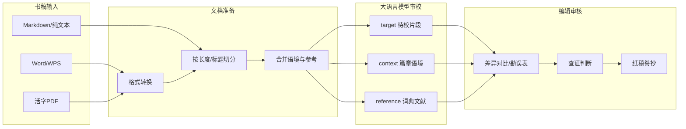
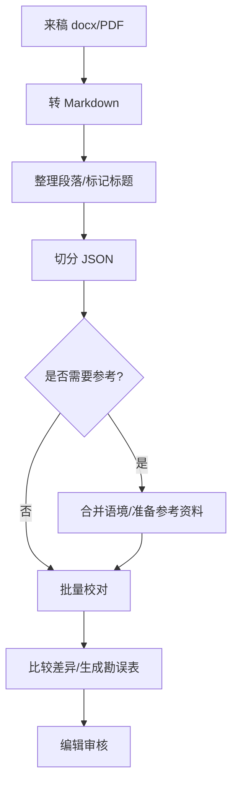

# AI Proofreader：大语言模型驱动的图书编校助手

*语文出版社  黄富雄*

**分类标签**

- 业务领域：图书编校
- 创新类型：效率创新

---

## 一、业务痛点

编校工作的核心痛点是：如何在有限的时间内，用有限的精力，在稿件语境的多维关系中发现疑点，并充分利用多种工具书、参考书、在线资源等完成查证与修改；对于某些稿件，甚至还需要对结构和语言表述进行重构。

做编辑这些年，最让我头疼、底气不足的环节就是校对。图书编校质量关系重大，但校对工作本身耗时、费力、单调。一本十来万字的书稿，要逐字逐句地看，很考验目力和耐心；时间一紧，就更容易漏检。更麻烦的是，许多错误并不是“多用心、多花时间”就能看出来的——前后表述不一致、专名前后写法不同、题与答对不上、引文与原文有出入，都需要在较长的语境中对照、查证。

教参、练习册、注释解读类图书的校对尤其吃力：题目和答案、正文和注释要对应一致；校对古诗解释时，需要对照权威版本；处理文言专名时，需要查词典条目。这些工作若全靠人工，在有限的编校周期内很难做得又快又细。

行业里常用的黑马、方正智能审校等工具，在错别字、常见异形词等规则性检查上仍有价值，但能力边界明显：几乎不能理解长上下文，因而难以发现前后矛盾；缺乏知识性审校能力，对文言引文、传统文化、百科事实等帮不上忙；也无法把教材、词典、权威文献当作参考资料一并提交，编辑仍要反复翻页、手工对照；对PDF稿件的处理能力差，对于全文注音、自由版面、零碎版面的图书，几乎无法处理；以“原文加描述性标签”的形式呈现结果，审核效率很低；基于规则的校对没有语境理解能力，正确率极低，审核负担很重。

2022年起，我开始关注大语言模型在文本处理上的表现；2023年底DeepSeek发布后，我结合个人编校需求，开发了开源VS Code扩展**AI Proofreader**，并在本社推广使用。实际对比表明，在我试用过的商业AI校对服务中，本工具在正确率、审核效率、可配置性等方面有明显优势。

---

## 二、核心思路

### 2.1 总体设计：三文本 + 人机协同工作流

方案的核心思路可以概括为一句话：

将书稿转为可处理的文本，按语境切分后，向大语言模型提交 **目标文本（target）+ 上下文（context）+ 参考资料（reference）**，由 AI 进行修改；编辑在差异对比界面查看修改前后的变化，并进行审核。

这与传统“黑盒式一键校对”不同：编辑始终掌握流程配置权（文本前后关系、切分方式、参考材料、提示词、温度等）和最终裁量权。

整体架构如下：

工具以 VS Code 扩展形式实现，开源发布于 GitHub（[Fusyong/ai-proofread-vscode-extension](https://github.com/Fusyong/ai-proofread-vscode-extension)）。编辑安装扩展、在阿里云百炼等平台申请 API 密钥即可使用，无需自建服务器；日常操作以**校对面板**为入口，docx/PDF 转换、切分、批量校对、差异比较等步骤可在一处完成。

### 2.2 相对传统审校工具的差异化能力

从效率创新视角看，本方案的价值在于：**在正确率、审核效率、可配置可扩展能力方面有明显优势**。

| 能力                 | 效率价值                             | 实现要点                                                   |
| -------------------- | ------------------------------------ | ---------------------------------------------------------- |
| 长上下文理解         | 减少前后矛盾、表述不一致的漏检       | 按章切分、段落扩展上下文、整篇作 context                   |
| 关联内容协同         | 题目与答案、正文与注释一次核对       | 合并 JSON，将关联段落拼入同一 target                       |
| 多轮专项审校         | 有针对性地扫描不同维度               | 预置提示词：硬伤发现、对应关系核对、表述正常化、拼音审校等 |
| 参考资料校对         | 缩短查证路径                         | JSON 合并、本地 MDict 词典、文献 grep/BM25/向量检索        |
| 知识核查（实验功能） | 自动查询词典、维基百科和本地参考资料 | 由 LLM 确定需查询内容并检索、精排后写入 reference          |
| 编辑记忆（实验功能） | 全书体例一致，减少重复说明           | 带记忆选段校对，维护项目级编辑记忆文件                     |

实际使用中，上述能力的效果普遍优于传统黑马、方正审校软件；在语言文字与一般知识校对方面，也优于我试用过的商业 AI 审校服务。

### 2.3 三种主要工作流

**（一）整书分切后批量校对**：

流程说明：将 Word、活字 PDF 等转为 Markdown（扩展内置 docx/PDF 转换命令，Windows 下 PDF 转文本已内置 Xpdf）；按长度或标题切分为数百个片段（经验上每段六百至八百字效果较佳，十余万字约三百段）；**细节校对宜按长度切分，前后一致性问题宜按章节切分或扩展上下文**，二者可结合使用；可选合并章节语境、词典摘录等；调用 API 批量校对——支持断点续校，已完成片段不重复处理；最后在 diff（差异）编辑器中审核，或以 Word 修订模式风格展示改动，或生成 HTML 勘误表及常用错词 CSV，便于积累个人错词表。

**（二）选段即时校对**，适合边读边改：选中段落，右键执行“proofread selection”，适合短文或精读场景。

**（三）带记忆选段校对**（实验功能），适合同一书稿的体例一致性修改：自动维护 `.proofread/editorial-memory.json`，将已确认的体例通则注入后续请求，减少重复说明。

此外，扩展还集成**引文核对**（本地文献库索引 + 相似度匹配，或 LLM 检索单条引文）、标题序号检查、重复句扫描、docx/PDF 格式转换等辅助功能，与 AI 语义校对形成互补：规则与检索兜底格式、引文、字形，大模型兜底语义与知识。

### 2.4 可扩展性：编辑主导的工作模式

扩展不把“校对”写死在单一功能里。用户可自定义提示词，让同一套三文本机制服务于润色、翻译、撰写提要、给文言文加标点，或开展意识形态风险排查、逻辑缺陷排查、欧化句法提示等专项审校。

也就是说，编辑可以结合书稿实际提出真问题，并结合编校经验给出切实可行的指导和真实贴切的样例，让 LLM 来执行。当前校对速度快（十万字用时不到一分钟）、单次成本低（每十万字大约 1 至 3 元），对同一书稿做多轮专项审校完全可行——这是效率创新得以持续放大的基础。

本插件利用 VS Code 强大的 diff 编辑器查看审校结果。校对完成后，差异以深红（删除）、深绿（插入）标出，编辑据此查证、判断，再誊抄到纸稿。这比传统审校工具“原文+描述式修改标签”直观得多，因而审核效率大大提高，审核负担大为减轻。采用条目式提示词（`item`）时，修改以 JSON 列出，侧栏「校对条目」可按置信度筛选、跳转定位，进一步减轻逐条核对负担。以下是 diff 编辑器界面：

以上为排版方便，用的是上下对比样式。实际工作中可改为更方便的左右对比样式。

### 2.5 预置提示词、知识核查、字词检查与用户自主扩展

除用户自定义提示词外，扩展内置下列预置提示词，可在“管理提示词”侧栏中直接选用；`full` 为全文输出，`item` 为条目式 JSON 输出（只列需改句，省 token，便于专项扫描）：

| 名称 | 输出类型 | 适用场景 |
|------|----------|----------|
| 系统默认提示词（full） | 全文 | 常规语言文字与知识性校对；**默认项** |
| 系统默认提示词（item） | 条目 | 同上，仅输出需改句子 |
| 表述正常化（full / item） | 全文 / 条目 | 凭语感修改违和处，使表述符合常情常理 |
| 硬伤发现（item） | 条目 | 只报必须改的硬伤；依据不足时标记较低 confidence |
| 对应关系核对（item） | 条目 | 专查指代、称谓、注释、题答、图表编号、数据单位等应对应一致的关系 |
| 知识核查（full / item） | 全文 / 条目 | 依据已准备的 reference 核查事实与释义，不臆造 |
| 拼音审校（full） | 全文 | 按部编版小学语文教材注音规则审校已有拼音 |
| 拼音加注（full） | 全文 | 以同上标准在行间加注拼音 |

同一书稿可先以“硬伤发现”筛硬伤，再以“对应关系核对”查题答一致，需要时再换“知识核查”，从而实现多轮专项审校。**用户还可以仿照这些提示词撰写自己的提示词。**

**知识核查**（实验功能）：校对前由大模型分析待校文本，自动规划需查询的专名、引文、术语等，再从本地 MDict 词典、工作区文献（grep / BM25 / 向量检索）、可选维基百科 API 检索相关材料，经精排后写入 `reference`，再调用“知识核查”提示词完成校对。适用于传统文化、学术类书稿中“需查工具书方能判断”的疑点；token 消耗高于普通校对，宜按需选用。批量处理时可用校对面板“准备参考资料”；选段处理可用 `knowledge verify selection` 命令。

**字词检查**：与 AI 语义校对互补的规则型检查，命令 `check words`，结果在侧栏“words checked”视图中逐条定位。三个分支：（1）基于词典数据的检查；（2）基于《通用规范汉字表》的检查（含繁体/异体字、异形词等）；（3）自定义替换表检查与替换——预置《通用规范汉字表》简繁异对照、《第一批异形词整理表》、《古籍印刷通用字规范字形表》及规范人名、年号等数据，**用户亦可加载自制正则替换表，用于个人积累的专项检查。** 字形、异形词、规范用字等确定性问题由规则兜底，语义与知识性问题交给大模型。

---

## 三、应用场景

本方案主要嵌入图书编校工作流，**直接受益方为编辑**；也可辅助作者撰稿，例如当作者表述能力较弱或文风潦草时，可用于重新组织文字。

| 场景              | 工作环节                  | 典型操作                          | 创造价值                                     |
| ----------------- | ------------------------- | --------------------------------- | -------------------------------------------- |
| 一般图书审校      | 初审/复审的文字与知识校对 | 整书切分 → 批量校对 → diff/勘误表 | 编辑：首轮筛查大幅提速；读者：降低低级错误率 |
| 语境合并审校      | 教参与练习册题答一致性核对、课文对照审校 | 合并 JSON +“对应关系核对”提示词   | 编辑：减少来回翻页核对                       |
| 传统文化/学术书   | 引文、专名、释义核查      | 知识核查 + 本地词典与文献库       | 编辑：快速获得查证线索                       |
| 个性化专项审校    | 如全文注音读物审校、古籍用字审校 | 撰写专项审校提示词用于校对；编写专项“正误表”并用于检查 | 编辑：解决书稿的特定问题，并可重复使用       |
| 边读边改          | 精读段落、局部疑难处理；统一体例 | 选段校对，可带上编辑记忆          | 编辑：即时辅助，不打断阅读节奏，累积样例并用于后续修改 |

以教参为例：可将课文原文、教材权威版本合并为 reference，将当章全文作为 context，对解读文字进行批量校对；若 AI 改动了某个表述，编辑再查工具书定论——过去需要“记住前文 + 翻教材 + 查词典”的串联动作，被压缩为“看 AI 提示 → 针对性查证”。

以小学语文练习册为例：题目与参考答案可经 JSON 合并命令拼入同一 target，再选用“对应关系核对”提示词，专查指代、题号、数据单位等应保持对应一致的内容；一轮扫描即可标出多处前后不一致之处，编辑再逐条核实，而不必在题目与答案之间来回翻阅对照。

以含文言引文的书稿为例：可将古籍原文、词典释义准备为 reference，启用“知识核查”流程——先从本地 MDict 词典与文献库检索相关条目，再据此校对目标段落，对引文讹误、释义偏差给出带依据的修改建议，大幅缩短“发现疑点”阶段的时间。

**在工作流中的位置**：用于辅助三审三校。AI Proofreader 定位于**编校效率助手**，明确不替代法定审校程序与编辑的专业判断。

---

## 四、效果

本方案已实现，形成稳定版软件；部分实验功能仍在开发中。

### 4.1 效率与成本

从效率创新角度，本方案改变了编校工作中时间与精力的分配结构：

- **速度**：十余万字的书稿，切分后批量提交 API，整体处理时间约 **1 至 2 分钟**（视平台限速与并发设置而定）。传统人工通读同样篇幅，即使粗读也需数日；AI 预扫将“第一轮找疑点”压缩至分钟级。
- **成本**：使用主流按量计费 API（如 DeepSeek、阿里云百炼等），单本书稿在普通校对模式下的 API 费用通常在 **1 至 3 元**（与模型选择、校对方式等有关）。相比外聘校对人员或按年付费的商业审校软件，边际成本极低，适合编辑个人或小团队按需使用。
- **人力结构变化**：编辑的工作重心从“全书逐句通读”转向“集中查证 AI 提示的疑点”，同一编校周期内可进行多轮专项扫描（硬伤/对应关系/知识核查），相当于在不增加人力的前提下提高检查覆盖度，把有限的人力用在刀刃上。

### 4.2 实践反馈

- 本人已用该工具处理约百种书稿（含协助同事处理的稿件）。
- 本社十多位编辑安装使用，并建有交流群分享经验；总编室质检流程中安排专岗，对未使用该工具处理过的稿件进行预检。
- VS Code 扩展安装量现为 **275**；建有 QQ 用户群供用户交流。

在语言文字和一般知识校对方面，即使在编辑常规工作负荷下，该工具的表现仍优于多数编辑的个人审读能力。

### 4.3 局限与风险

1. **AI 存在盲区**：幻觉、过度修改、漏检均可能发生，所有结果必须由合格的编辑审核。建议将查证后的修改誊录到纸稿上；除非编辑对电子稿有充分把握，否则不建议将修改自动写回电子版定稿。
2. **长文档需合理切分**：片段过长或语境不全都会影响质量。需按书稿类型选择切分策略，最好长短结合：短片段用于审校文字细节，完整语境用于审校一致性问题。
3. **实验功能成本较高**：编辑记忆、知识核查等功能会显著增加 Token 消耗，应根据书稿需要选用。
4. **不替代三审三校**：本方案仅可作为三审三校的辅助手段，不可减免法定流程。

---

## 五、AI 使用说明

本方案从问题发现、工具开发到方案撰写，均借助 AI 工具完成了不同阶段的工作：

1. **Cursor**
   用于程序开发。
2. **DeepSeek、通义千问等对话模型**
   早期用于探索“大模型能否辅助图书校对”，比较不同模型与提示词的校对效果，迭代系统提示词。
3. **大模型 API**
   实际使用扩展时调用阿里云百炼、DeepSeek 等平台的 API。

**各工具所起作用归纳**：模型能力评测与选型、提示词工程、代码实现辅助、方案文案结构与表述优化。需要强调的是，业务痛点、编校规范、提示词中的专业要求与样例、自检检查中的专业数据，均由作者完成。

本文则由Cursor根据扩展项目库文档和本人的提示完成，并经过本人审改，用AI Proofreader校对。

---

## 六、附录：代码库与文档

* 完整代码库：[https://github.com/Fusyong/ai-proofread-vscode-extension](https://github.com/Fusyong/ai-proofread-vscode-extension)（当前版本 v1.11.2）
  * [说明文档](https://github.com/Fusyong/ai-proofread-vscode-extension/blob/main/README.md)
  * [命令速查与业务流程](https://github.com/Fusyong/ai-proofread-vscode-extension/blob/main/docs/commands-cheatsheet.md)
* 原型 Python 库：[Fusyong/ai-proofread](https://github.com/Fusyong/ai-proofread)
* VS Code 插件市场：[AI Proofreader](https://marketplace.visualstudio.com/items?itemName=HuangFusyong.ai-proofreader)
