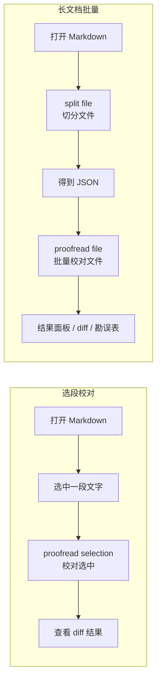
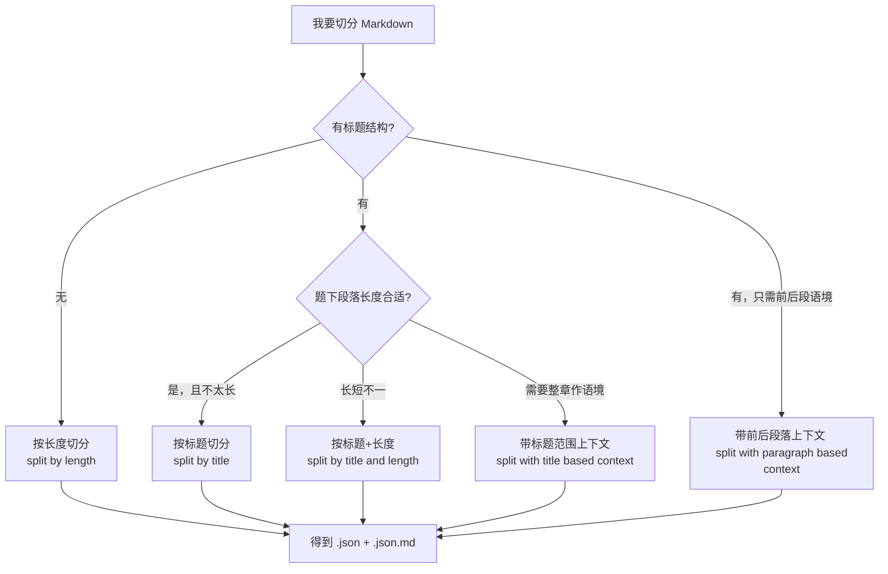
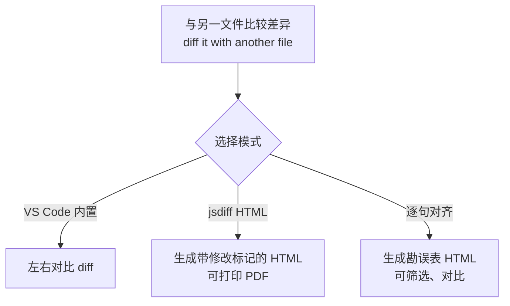
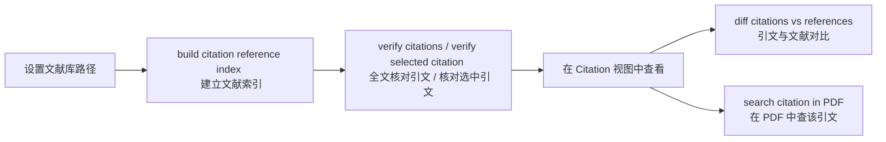

# AI Proofreader 扩展命令速查与业务流程图

*v1.4.0*

面向普通用户的命令一览与操作流程说明。所有命令均可通过 **命令面板**（Ctrl+Shift+P）输入「AI Proofreader」查找；部分命令也可在**右键菜单**中使用。

---

## 一、命令速查表（按功能分组）

| 命令（在命令面板中搜索） | 简短说明 |
|--------------------------|----------|
| **文档转换** | |
| AI Proofreader: convert docx to markdown | 将 Word(docx) 转为 Markdown，需安装 Pandoc |
| AI Proofreader: convert PDF to markdown | 将活文字 PDF 转为 Markdown，需安装 pdftotext |
| AI Proofreader: convert markdown to docx | 将 Markdown 转为 Word(docx) |
| **文档整理** | |
| AI Proofreader: format paragraphs | 整理段落：段末加空行 / 删除段内分行 |
| AI Proofreader: mark titles from table of contents | 根据目录表（Markdown 列表）在文档中标记标题 |
| AI Proofreader: convert quotes to Chinese | 半角引号转全角（可设为校对后自动执行） |
| **文档切分** | |
| AI Proofreader: split file | 切分文件（统一入口，会提示选择切分模式） |
| AI Proofreader: split by length | 按长度切分，输入目标字符数 |
| AI Proofreader: split by title | 按标题切分，输入标题级别（如 1,2） |
| AI Proofreader: split by title and length | 按标题+长度：题下过长则再切、过短则合并 |
| AI Proofreader: split with title based context | 按长度切分，并为每段配上所在标题范围的上下文（注意 token 费用） |
| AI Proofreader: split with paragraph based context | 按长度切分，并为每段配上前后段落作为上下文（注意 token 费用） |
| **合并与校对** | |
| AI Proofreader: merge two files | 合并两个 JSON：把语境/参考资料并入校对用 JSON |
| AI Proofreader: proofread selection | 校对当前选中的文本（选段校对） |
| AI Proofreader: proofread file | 批量校对当前打开的 JSON 文件 |
| **比较与结果** | |
| AI Proofreader: diff it with another file | 比较两个文件差异（内置 diff / 生成 HTML 差异 / 生成勘误表） |
| AI Proofreader: reopen result panel | 重新打开切分/校对结果面板 |
| **提示词** | |
| AI Proofreader: set prompts | 管理提示词：增、删、改（无图形界面，粘贴编辑） |
| AI Proofreader: select prompt | 选择当前使用的提示词 |
| **PDF 与引文** | |
| AI Proofreader: search selection in PDF | 在同名 PDF 中搜索当前选中文本（需 SumatraPDF） |
| AI Proofreader: build citation reference index | 建立本地文献库索引（引文核对前需先执行） |
| AI Proofreader: verify citations | 打开引文核对视图，批量核对全文引文 |
| AI Proofreader: verify selected citation | 核对当前选中的引文 |
| AI Proofreader: diff citations vs references | 对比引文与文献差异（在引文视图中对单项使用） |
| AI Proofreader: search citation in PDF | 在文献 PDF 中搜索该条引文（在引文视图中对单项使用） |

---

## 二、典型业务流程（Mermaid 图）

### 2.1 从零到校对结果：整体流程

### 2.2 两种校对方式

### 2.3 切分模式选择（决策简图）

### 2.4 比较与勘误

### 2.5 引文核对流程

---

## 三、按场景的快速入口

| 我想… | 建议操作 |
|-------|----------|
| 校对这一小段 | 选中 → 右键 **proofread selection** 或命令面板同名命令 |
| 校对这一整份长稿 | **split file** → 选模式 → 结果面板点「校对 JSON 文件」或对 JSON 用 **proofread file** |
| 先整理再切分 | **format paragraphs** / **mark titles from table of contents** → **split file** |
| 合并语境再校对 | 打开校对用 JSON → **merge two files** → 选语境/参考 JSON 与字段 → **proofread file** |
| 看改了哪里 | 对 md 或 json 用 **diff it with another file**，或结果面板「比较前后差异」「生成勘误表」 |
| 换一种 AI 用法 | **set prompts** 编辑提示词 → **select prompt** 选用 |
| 核对引文 | **build citation reference index**（仅首次或更新文献后）→ **verify citations** 或选中后 **verify selected citation** |

---

## 四、重要设置项

进入方式：VS Code 左下角齿轮 ⚙️ → 扩展里找到 AI Proofreader → 点击设置；或命令面板（Ctrl+Shift+P）搜索 **Preferences: Open Settings (UI)**，在搜索框输入 `ai-proofread` 筛选本扩展设置。

### 4.1 大模型与 API（必配）

| 设置项 | 简短说明 |
|--------|----------|
| **proofread.platform** | 大模型服务平台：deepseek / aliyun / google / ollama |
| **apiKeys.deepseek** | Deepseek 开放平台 API 密钥（平台选 deepseek 时必填） |
| **apiKeys.aliyun** | 阿里云百炼 API 密钥（平台选 aliyun 时必填） |
| **apiKeys.google** | Google Gemini API 密钥（平台选 google 时必填） |
| **apiKeys.ollama** | Ollama 本地服务地址，如 `http://localhost:11434` |
| **proofread.models.deepseek** | Deepseek 模型名，如 deepseek-chat（推理模型易超时） |
| **proofread.models.aliyun** | 百炼模型名，如 qwen-max、qwen-plus 等 |
| **proofread.models.google** | Gemini 模型名，如 gemini-2.5-pro、gemini-2.5-flash |
| **proofread.models.ollama** | Ollama 本地模型名，如 gemma3:1b、llama3.2:3b |

### 4.2 校对行为（常用）

| 设置项 | 简短说明 |
|--------|----------|
| **proofread.temperature** | 模型温度 [0~2)，默认 1.0；低更稳定，高更有创造性，可多遍不同温度尝试 |
| **proofread.rpm** | 每分钟最大请求数；Deepseek 无硬限，百炼 qwen-max 稳定版常为 600 |
| **proofread.maxConcurrent** | 最大并发请求数，默认 10；百炼建议 10 |
| **proofread.timeout** | 单次 API 请求超时时间（**秒**），默认 90 |
| **proofread.retryAttempts** | 失败重试次数，默认 3 |
| **proofread.retryDelay** | 重试间隔（**秒**），默认 1 |
| **proofread.promptRepetition** | 提示词重复模式：none / target / all，可提高准确度但增加输入 token |
| **proofread.disableThinking** | 是否禁用模型“思考”（Gemini 2.5 等），校对建议开启以提速 |
| **convertQuotes** | 是否在校对后自动将半角引号转为中文全角 |

### 4.3 文档切分默认值

| 设置项 | 简短说明 |
|--------|----------|
| **defaultSplitLength** | 按长度切分时的默认目标字符数，默认 600 |
| **defaultTitleLevels** | 按标题切分时的默认标题级别，如 [2] 表示二级标题 |
| **titleAndLengthSplit.threshold** | 标题+长度模式：超过此长度的段落再切分，默认 1000 |
| **titleAndLengthSplit.minLength** | 标题+长度模式：小于此长度的段落合并，默认 120 |
| **proofread.defaultContextLevel** | 选段校对时默认的标题级语境范围，0 表示不用 |
| **paragraphContextSplit.beforeParagraphs** | 段落语境切分：前文段落数，默认 1 |
| **paragraphContextSplit.afterParagraphs** | 段落语境切分：后文段落数，默认 1 |

### 4.4 勘误表 / 句子对齐

| 设置项 | 简短说明 |
|--------|----------|
| **alignment.similarityThreshold** | 句子对齐相似度阈值 (0–1)，默认 0.4 |
| **alignment.windowSize** | 对齐搜索窗口大小（锚点左右各 N 句），默认 10 |
| **alignment.ngramSize** | 相似度计算 N-gram 大小，默认 2（bigram） |

### 4.5 引文核对

| 设置项 | 简短说明 |
|--------|----------|
| **citation.referencesPath** | 参考文献根路径，支持 `${workspaceFolder}` 或绝对路径 |
| **citation.matchesPerCitation** | 每条引文显示的文献匹配条数，默认 2 |
| **citation.minCitationLength** | 有效引文最小长度（字符），过短可被忽略，默认 5 |
| **citation.ignoredCitationTypes** | 忽略的引文类型：short（过短）、noFootnote（无注码）等 |
| **citation.lenDeltaRatio** | 候选文献句长度允许偏离比例，默认 0.2（±20%） |

### 4.6 提示词与调试

| 设置项 | 简短说明 |
|--------|----------|
| **prompts** | 自定义提示词列表（名称 + 内容）；也可用命令「set prompts」管理 |
| **debug.enableConsoleLog** | 是否输出调试日志到控制台（影响性能，仅调试时开） |

---

## 五、说明与建议

- **Mermaid 图**：可在支持 Mermaid 的 Markdown 预览（如 VS Code 插件）、GitHub/GitLab、Notion 等中直接渲染为流程图。
- **命令查找**：命令面板（Ctrl+Shift+P）输入「AI Proofreader」或「proofread」「split」「convert」等关键词即可缩小范围。
- **设置单位**：`proofread.retryDelay` 与 `proofread.timeout` 的单位均为 **秒**（旧版若按毫秒设过，升级后请检查）。
- **详细说明**：每个命令的详细用法、依赖（Pandoc、pdftotext、SumatraPDF 等）和注意事项见 [README.md](../README.md)。

若你希望增加「按字母排序的一页纸 cheatsheet」或「仅流程图的一页版」，可以说明偏好，我可以再补一版。
