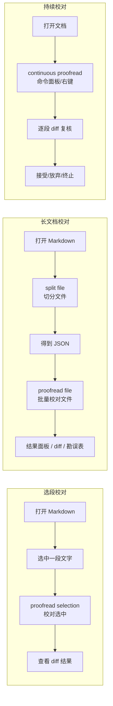
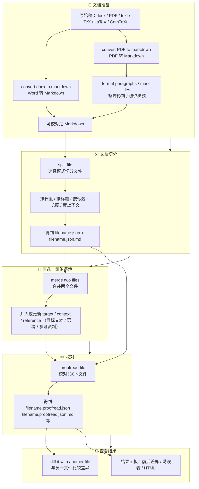
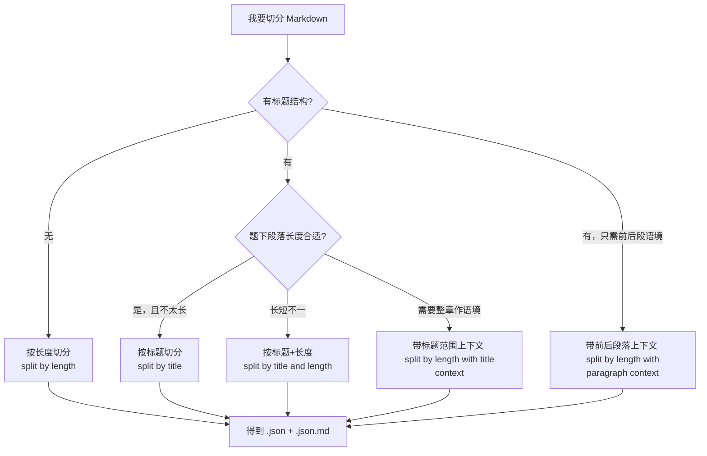
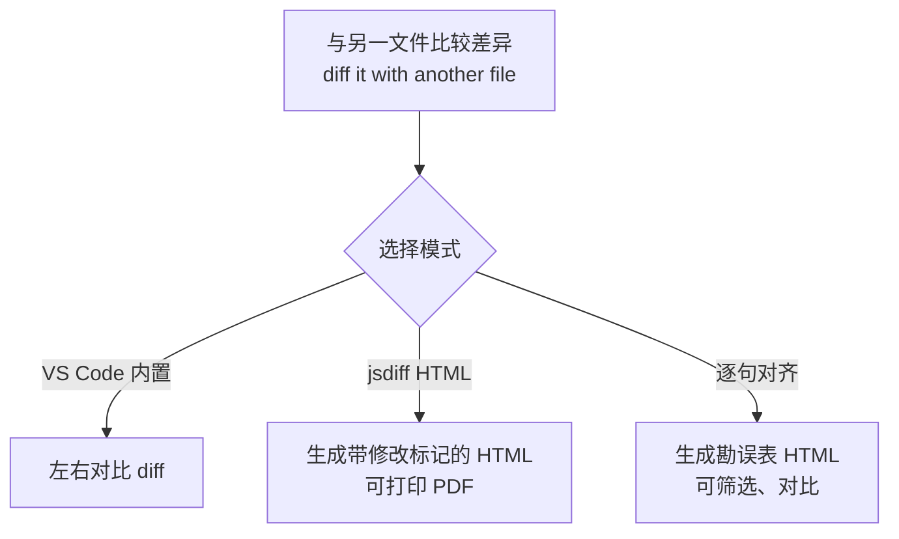
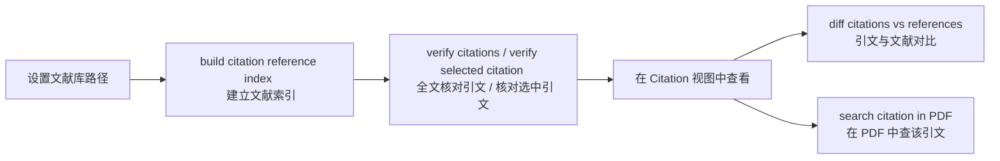

# AI Proofreader 扩展命令速查与业务流程图

*v1.7.0*

> **文档定位**：本文档是**快速入口**——帮你从业务场景找到对应流程和命令。详细说明、依赖安装、最佳实践见扩展主页面或 [README](https://github.com/Fusyong/ai-proofread-vscode-extension/blob/main/README.md)。

---

## 30 秒概览

**三个入口**：按 Ctrl+Shift+P 打开**命令面板**，输入「open proofreading panel」，回车即可打开**校对面板**。在命令面板中输入「AI Proofreader」能查到所有命令，这是最快捷的入口。校对面板则以按钮的形式集中了大部分命令，比较直观。部分命令也能从**右键菜单**找到。

| 能力 | 说明 |
|------|------|
| **三种校对方式** | ① 选段校对：选中 → **右键** proofread selection；② 长文档：**校对面板** 选主文件 → 点「切分文档」→ 点「校对JSON文件」；③ 持续校对：**校对面板** 点「持续校对」或 **右键** |
| **文档准备** | **校对面板** 有 docx/PDF （可选）、整理段落、标记标题、切分等**按钮** |
| **结果查看** | **校对面板**「比较前后差异」「生成勘误表」**按钮**；或 diff 命令 |
| **辅助功能** | **校对面板** 有字词检查、引文核对等**按钮**；**侧栏**有 words checked、citations、标题树等**视图** |
| **用户扩展能力** | 自定义提示词、校对样例、自定义替换表、jieba 词典、标题/序号规则，见 [第六节](#六用户扩展能力) |

---

## 目录

- [一、各业务场景快速入口](#一各业务场景快速入口)
- [二、业务词汇 → 功能对照](#二业务词汇--功能对照)
- [三、典型业务流程（Mermaid 图）](#三典型业务流程mermaid-图)
- [四、命令速查表](#四命令速查表)
- [五、重要设置项](#五重要设置项)
- [六、用户扩展能力](#六用户扩展能力)
- [七、说明与建议](#七说明与建议)

---

## 一、各业务场景快速入口

从你的稿件类型或任务出发，找到简明操作指引。流程图见 [第三节](#三典型业务流程mermaid-图)。

### 1.1 书稿（Word/PDF 来稿，整本书校对）

先打开 **校对面板**（命令 open proofreading panel），面板内有**按钮**完成大部分操作。

| 步骤 | 操作（优先用 UI） |
|------|-------------------|
| 1. 打开面板 | 命令面板输入「open proofreading panel」→ 打开 **校对面板** |
| 2. 文件转换（可选） | 面板顶部点 **「docx → Markdown」** 或 **「PDF → Markdown」**（需先安装 Pandoc / pdftotext） |
| 3. 选主文件 | 面板内点 **「选择主文件」** 或 **「从工作区选择」** |
| 4. 整理（可选） | 面板内点 **「整理段落」**、**「根据目录标记标题」** |
| 5. 切分 | 面板内点 **「切分文档」**，选择切分模式（见 [3.3](#33-切分模式选择决策简图)） |
| 6. 校对 | 面板内点 **「校对JSON文件」** |
| 7. 查看 | 面板内点 **「比较前后差异」** 或 **「生成勘误表」** |

### 1.2 单篇文章 / 选段

| 任务 | 操作（优先用 UI） |
|------|-------------------|
| 校对这一小段 | 选中文字 → **右键** → **proofread selection**；或 **校对面板** 顶部点 **「校对选中文本」** |
| 持续校对 | **校对面板** 点 **「持续校对」**，或 **右键** → continuous proofread；每段完成后关闭 diff 窗口，在弹窗中选择 **「接受并继续」**、**「放弃」** 或 **「终止校对」** |

### 1.3 练习册（题 + 答案需一起校对）

| 步骤 | 操作（优先用 UI） |
|------|-------------------|
| 1. 切分 | **校对面板** 选主稿 → 点 **「切分文档」**，得到 JSON |
| 2. 合并语境 | **校对面板** 切分完成后，点 **「合并语境/参考资料」**，选答案文件，拼接到 target 或 context |
| 3. 校对 | **校对面板** 点 **「校对JSON文件」** |

### 1.4 学术稿（需核对引文）

| 步骤 | 操作（优先用 UI） |
|------|-------------------|
| 1. 建索引 | 设置 `citation.referencesPath`（齿轮 ⚙️ → 扩展设置）→ **校对面板** 点 **「建立引文索引」** |
| 2. 核对 | **校对面板** 点 **「核对全文引文」**；或选中引文后 **右键** → verify selected citation |
| 3. 反查 | 打开 **侧栏「citations」视图**，对某条引文 **右键** → **search citation in PDF** |

### 1.5 专项检查（错别字、异形词、序号）

| 任务 | 操作（优先用 UI） |
|------|-------------------|
| 字词检查 | **校对面板** 点 **「字词检查」** → 打开 **侧栏「words checked」视图**，**右键**某条可「上一处」「下一处」「应用替换」 |
| 标题与序号 | 命令 **check numbering hierarchy** → 打开 **侧栏「标题树」「段内序号」视图**，**右键**可「定位到文档」「标记为标题」「升级」「降级」 |

### 1.6 其他常用操作

| 我想… | 建议操作（优先用 UI） |
|-------|------------------------|
| 看改了哪里 | **校对面板** 点 **「比较前后差异」** 或 **「生成勘误表」**；或对文件 **右键** → diff it with another file |
| 换一种 AI 用法 | **校对面板** 点 **「管理提示词」**；在 **侧栏「prompts」视图** 中点击选择当前提示词 |
| 分词或词频统计 | **校对面板** 顶部点 **「分词」**、**「词频统计」** 或 **「字频统计」** |
| 转 Word 交稿 | **校对面板** 顶部点 **「Markdown → docx」** |

---

## 二、业务词汇 → 功能对照

用 Ctrl+F 搜索业务词，快速定位功能。

| 业务词 | 对应功能 |
|--------|----------|
| 校稿、审稿、改错 | proofread selection / proofread file |
| 出勘误表、审校记录 | diff it with another file → 逐句对齐 |
| 核对引文、查出处 | verify citations + search citation in PDF |
| 转 Word、转 Markdown | convert docx/markdown |
| 查错别字、异形词 | check words |
| 检查序号、标题层级 | check numbering hierarchy |
| 分词、词频、字频 | segment file / segment selection |
| 合并语境、加参考资料 | merge two files |

---

## 三、典型业务流程（Mermaid 图）

### 3.1 三种校对方式

### 3.2 长文档校对整体流程

### 3.3 切分模式选择（决策简图）

### 3.4 比较与生成勘误表/审校记录

### 3.5 引文核对流程

---

## 四、命令速查表

**优先用 UI**：大部分操作可在 **校对面板**（命令 open proofreading panel 打开）内通过**按钮**完成，或通过**右键菜单**、**侧栏视图**操作。命令面板（Ctrl+Shift+P）输入「AI Proofreader」可查找全部命令。⭐ 表示核心/常用。

| 命令 | 简短说明 |
|------|----------|
| **文档转换** | |
| AI Proofreader: convert docx to markdown | 将 Word(docx) 转为 Markdown，需安装 Pandoc |
| AI Proofreader: convert PDF to markdown | 将活文字 PDF 转为 Markdown，需安装 pdftotext |
| AI Proofreader: convert markdown to docx | 将 Markdown 转为 Word(docx) |
| **文档整理** | |
| AI Proofreader: format paragraphs | 整理段落：段末加空行 / 删除段内分行 |
| AI Proofreader: mark titles from table of contents | 根据目录表（Markdown 列表）在文档中标记标题 |
| AI Proofreader: check numbering hierarchy | 检查带序号的标题，也可用于标记这些标题 |
| AI Proofreader: convert quotes to Chinese | 半角引号转全角（可设为校对后自动执行） |
| **文档切分与语境合并** | |
| AI Proofreader: split file ⭐ | 切分文件（统一入口，会提示选择切分模式） |
| AI Proofreader: split by length | 按长度切分，输入目标字符数 |
| AI Proofreader: split by title | 按标题切分，输入标题级别（如 1,2） |
| AI Proofreader: split by title and length | 按标题+长度：题下过长则再切、过短则合并 |
| AI Proofreader: split by length with title context | 按长度切分，并为每段配上所在标题范围的上下文（注意 token 费用） |
| AI Proofreader: split by length with paragraph context | 按长度切分，并为每段配上前后段落作为上下文（注意 token 费用） |
| AI Proofreader: merge two files | 合并两个 JSON：把语境/参考资料并入校对用 JSON |
| **合并与校对** | |
| AI Proofreader: open proofreading panel ⭐ | 打开 **校对面板**（集中了切分、校对、比较等**按钮**，是主要 UI 入口） |
| AI Proofreader: proofread file ⭐ | 批量校对当前打开的 JSON 文件 |
| AI Proofreader: proofread selection ⭐ | 校对当前选中的文本（选段校对） |
| AI Proofreader: proofread selection with examples | 带样例校对选中文本（参考 .proofread/examples.md） |
| AI Proofreader: continuous proofread ⭐ | 持续发现与监督校对（实验功能，命令面板或右键菜单） |
| AI Proofreader: stop continuous proofread | 终止持续校对 |
| AI Proofreader: edit Proofreading examples | 编辑校对样例（基于选中文本或 diff 窗口） |
| AI Proofreader: split into sentences | 将文本切分为句子（用于整理校对样例等） |
| **比较与结果呈现** | |
| AI Proofreader: diff it with another file ⭐ | 比较两个文件差异（内置 diff / 生成 HTML 差异 / 生成勘误表） |
| AI Proofreader: search selection in PDF | 在同名 PDF 中搜索当前选中文本（需 SumatraPDF） |
| **提示词** | |
| AI Proofreader: manage prompts | 管理提示词：增、删、改；在侧栏 prompts 视图中选择当前提示词 |
| **分词与统计** | |
| AI Proofreader: segment file | 分词 / 词频统计 / 字频统计（整文件） |
| AI Proofreader: segment selection | 分词 / 词频统计 / 字频统计（选中部分） |
| **专项检查** | |
| AI Proofreader: check words | 字词检查：词典检查、通用规范汉字表、自定义替换表 |
| AI Proofreader: manage custom tables | 管理自定义替换表 |
| AI Proofreader: check numbering hierarchy | 检查标题序号层级与段内序号 |
| **PDF 与引文** | |
| AI Proofreader: build citation reference index | 建立本地文献库索引（引文核对前需先执行） |
| AI Proofreader: verify citations | 打开引文核对视图，批量核对全文引文 |
| AI Proofreader: verify selected citation | 核对当前选中的引文 |
| diff citations vs references | 对比引文与文献差异（**侧栏 citations 视图** 中 **右键** 某条使用） |
| search citation in PDF | 在文献 PDF 中搜索该条引文（**侧栏 citations 视图** 中 **右键** 某条使用） |

---

## 五、重要设置项

**进入方式**：VS Code 左下角 **齿轮 ⚙️** → **扩展** → 找到 AI Proofreader → 点击 **设置**；或 **校对面板** 顶部点 **「打开设置」**；或命令面板搜索 Preferences: Open Settings (UI)，搜索框输入 `ai-proofread`。

### 5.1 必配：大模型与 API

| 设置项 | 简短说明 |
|--------|----------|
| **proofread.platform** | 大模型服务平台：deepseek / aliyun / google / ollama |
| **apiKeys.deepseek** | Deepseek 开放平台 API 密钥（平台选 deepseek 时必填） |
| **apiKeys.aliyun** | 阿里云百炼 API 密钥（平台选 aliyun 时必填） |
| **apiKeys.google** | Google Gemini API 密钥（平台选 google 时必填） |
| **apiKeys.ollama** | Ollama 本地服务地址，如 `http://localhost:11434` |
| **proofread.models.*** | 各平台模型名，如 deepseek-chat、qwen-max、gemini-2.5-pro 等 |

### 5.2 常用：校对行为与切分

| 设置项 | 简短说明 |
|--------|----------|
| **proofread.temperature** | 模型温度 [0~2)，默认 1.0 |
| **proofread.timeout** | 单次 API 请求超时（**秒**），默认 90 |
| **proofread.rpm** | 每分钟最大请求数；百炼 qwen-max 稳定版常为 600 |
| **proofread.maxConcurrent** | 最大并发请求数，默认 10 |
| **proofread.disableThinking** | 是否禁用模型“思考”（Gemini 2.5 等），校对建议开启 |
| **convertQuotes** | 是否在校对后自动将半角引号转为中文全角 |
| **defaultSplitLength** | 按长度切分时的默认目标字符数，默认 600 |
| **defaultTitleLevels** | 按标题切分时的默认标题级别，如 [2] |
| **proofread.defaultContextLevel** | 选段校对时默认的标题级语境范围，0 表示不用 |

### 5.3 进阶：勘误表、引文、字词、序号

| 类别 | 主要设置项 |
|------|------------|
| **勘误表/对齐** | alignment.similarityThreshold、windowSize、ngramSize、ngramGranularity |
| **jieba 分词** | jieba.customDictPath、jieba.cutMode |
| **引文核对** | citation.referencesPath、matchesPerCitation、minCitationLength、lenDeltaRatio |
| **字词检查** | wordCheck.replacePrefix/Suffix、wordErrorCollector.* |
| **标题与序号** | numbering.ignoreMarkdownPrefix、customLevels、customInlinePatterns |

完整配置说明见 [README - 配置](https://github.com/Fusyong/ai-proofread-vscode-extension/blob/main/README.md)。

---

## 六、用户扩展能力

用户可通过以下方式扩展或定制扩展行为，无需改代码。

| 扩展项 | 入口 / 配置 | 简要说明 |
|--------|-------------|----------|
| **自定义提示词** | **校对面板**「管理提示词」；**侧栏 prompts 视图** 新建/编辑/删除 | 可做翻译、专项核查、注释等，不限于校对；需说明 target、reference、context 三种文本 |
| **校对样例** | 命令 **edit Proofreading examples**；文件 `.proofread/examples.md` | 积累「原文→修改」样例，供「带样例校对」「持续校对」参考；可手动编辑 |
| **自定义替换表** | **校对面板**「管理自定义替换表」；**侧栏 custom checks 视图** 加载 .txt | 字词检查用，支持正则；可积累勘误表生成的 `.word-errors.csv` 中的错词 |
| **jieba 自定义词典** | 设置 `jieba.customDictPath` | 分词、词频、勘误表对齐等用；格式：每行「词语 词频 词性」 |
| **标题层级规则** | 设置 `numbering.customLevels` | 标题树检查用；自定义序号格式（如「前言」「单一单元」） |
| **段内序号规则** | 设置 `numbering.customInlinePatterns` | 段内序号检查用；自定义 pattern |

详细说明见扩展主页面或 [README](https://github.com/Fusyong/ai-proofread-vscode-extension/blob/main/README.md)。

---

## 七、说明与建议

- **Mermaid 图**：可在支持 Mermaid 的 Markdown 预览（如 VS Code 插件）、GitHub/GitLab、Notion 等中直接渲染为流程图。
- **命令查找**：命令面板（Ctrl+Shift+P）输入「AI Proofreader」或「proofread」「split」「convert」「check」等关键词即可缩小范围。
- **详细说明**：每个命令的详细用法、依赖（Pandoc、pdftotext、SumatraPDF 等）和注意事项见扩展主页面或 [README](https://github.com/Fusyong/ai-proofread-vscode-extension/blob/main/README.md)；设置说明则可以在设置界面看到。
