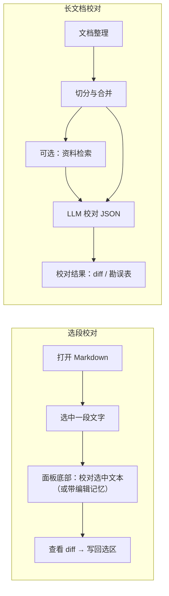
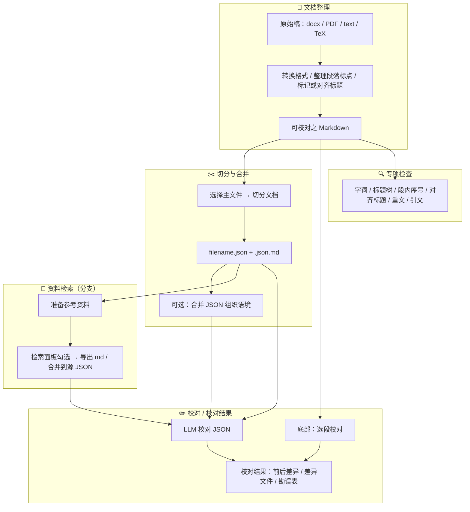
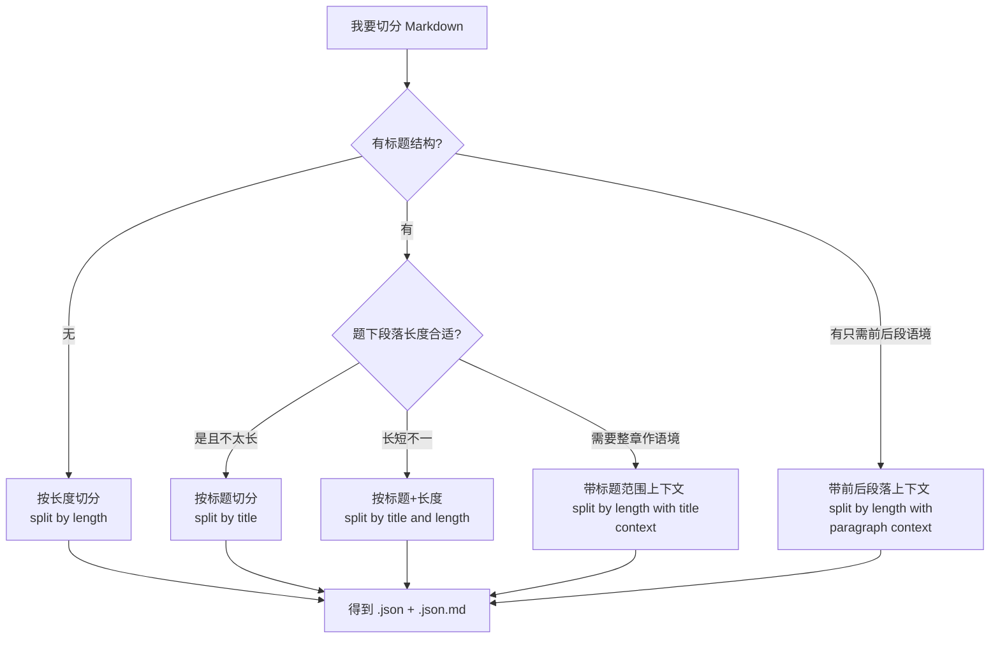
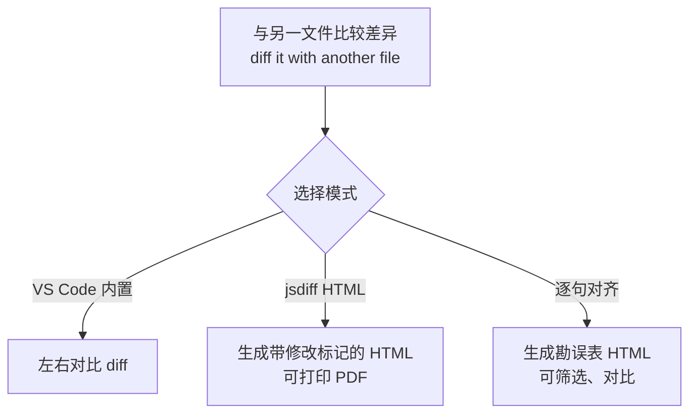

# AI Proofreader 扩展命令速查与业务流程图

*v1.12.8*

> **文档定位**：本文档是**快速入口**——帮你从业务场景找到对应流程和命令。详细说明、依赖安装、最佳实践见扩展主页面或 [README](../README.md)；完整版本历史见 [changelog.md](changelog.md)。

---

## 30 秒概览

**四个入口**：（1）左侧活动栏 **overview**：打开**校对面板** / **检索面板**，并开关侧栏 TreeView；（2）**校对面板**按四块组织日常工作；（3）**检索面板**是「切分与合并」的资料检索分支（**不做校对**）；（4）命令面板（Ctrl+Shift+P）输入「AI Proofreader」可查全部命令；部分命令也有**右键菜单**。

| 业务场景 | 面板位置 | 说明 |
|----------|----------|------|
| **文档整理** | 校对面板第一块 | 转换格式、段落/空白/标点用字、标记或对齐标题、分句分词、比较文件；作用于当前编辑窗口 |
| **切分与合并** | 校对面板第二块 | 选主文件 → 切分 → 合并 JSON；切出 JSON 后可「准备参考资料」「LLM 校对 JSON」 |
| **资料检索** | 检索面板（切分与合并的分支） | 多源准备 → 侧栏「资料检索」勾选 → 导出 md 或合并到源 JSON；选段检索不必先切分 |
| **校对 / 校对结果** | 切分区块内校对 JSON；底部选段校对；第三块看结果 | 进度、前后差异、差异文件、勘误表 |
| **专项检查** | 校对面板第四块 | 字词、标题树、段内序号、对齐标题、重文、引文核对 |
| **知识核查** | 预置提示词 | 先资料检索，再在校对时选用；不是独立命令 |
| **用户扩展能力** | 提示词 / 替换表等 | 见 [第六节](#六用户扩展能力) |

### 术语简表

| 术语 | 含义 |
|------|------|
| **资料准备** | 多源检索 → 过程文件 + 侧栏「资料检索」；不自动校对；JSON 不自动写 `reference` |
| **知识核查** | 预置校对提示词；校对面板选用 |
| **意图检索** | 自然语言描述检索意图后多源检索 |
| **核对选中引文** | → 侧栏「引文核查」（选区去掉行首 `>`，与全文同一套相似度匹配） |
| **核对全文引文** | → 侧栏「引文核查」（须先建立参考资料索引） |
| **直接查词典** | 无 LLM，整词查 MDX |

---

## 目录

- [一、各业务场景快速入口](#一各业务场景快速入口)
- [二、业务词汇 → 功能对照](#二业务词汇--功能对照)
- [三、典型业务流程（Mermaid 图）](#三典型业务流程mermaid-图)
- [四、命令速查表](#四命令速查表)
- [五、重要设置项](#五重要设置项)
- [六、用户扩展能力](#六用户扩展能力)
- [七、说明与建议](#七说明与建议)

---

## 一、各业务场景快速入口

按校对面板四块 + 资料检索分支操作。流程图见 [第三节](#三典型业务流程mermaid-图)。稿件类型示例见 [1.6](#16-按稿件类型)。

### 1.1 文档整理

| 我想… | 操作（校对面板第一块） |
|-------|------------------------|
| 转 Markdown / 交 Word | **「docx → Markdown」** / **「PDF → Markdown」** / **「Markdown → docx」** |
| 分段、去空白 | **「整理段落」**、**「删除行中空白」** |
| 标点与用字 | **「半角引号转全角」**、**「半角标点转全角」** / **「全角标点转半角」**、**「繁简转换」**、**「方正带圈序号」** |
| 标题 | **「根据目录标记标题」**；并排两个 md 后 **「对齐标题」** |
| 分句 / 词频 | **「切分为句子」**、**「分词与统计」** |
| 对照两个稿本 | **「与另一文件比较」** |

### 1.2 切分与合并

| 步骤 | 操作（校对面板第二块） |
|------|------------------------|
| 1. 选主文件 | **「选择主文件」** 或 **「从工作区选择」** |
| 2. 切分 | **「切分文档」**，选择切分模式（见 [3.3](#33-切分模式选择决策简图)） |
| 3. 合并语境（可选） | **「合并 JSON」**；可忽略当前文件指定标题级别开头的单元 |
| 4. 资料检索（可选） | **「准备参考资料」** → 进入 [1.3](#13-资料检索切分与合并的分支) |
| 5. 批量校对 | **「LLM 校对 JSON」** → 结果在「校对结果」 |

### 1.3 资料检索（切分与合并的分支）

JSON：切分区块 **「准备参考资料」**。选段：overview → **检索面板**（不必先切分）。**检索面板不做校对。**

| 任务 | 操作 |
|------|------|
| 多源准备 | 勾选来源 → **开始准备** → 侧栏 **资料检索** 勾选命中 |
| JSON 写入 reference | **合并选中到源 JSON**（唯一正式路径；不自动写入） |
| 选段导出 | **导出 md** → 回到校对面板选段校对，可选用「知识核查」 |
| 意图 / 词典 / 外跳 | 检索面板底部：意图检索、直接查词典、PDF / 识典 / 古籍库 |
| 核对引文 | **核对选中引文** / **核对全文引文** → 引文核查（须先建索引） |
| 清除检索缓存 | 检索面板 **「清除检索缓存」** |

### 1.4 校对 / 校对结果

| 任务 | 操作 |
|------|------|
| 校对这一小段 | 选中文字 → 校对面板底部 **校对选中文本**（或 **带编辑记忆**）；或右键 |
| 批量校对 JSON | 切分与合并区块 **「LLM 校对 JSON」** |
| 看改了哪里 | **校对结果** **「比较前后差异」** / **「生成差异文件」** / **「生成勘误表」** |
| 换一种 AI 用法 | overview **提示词**；或「管理提示词」后在校对时选用 |

### 1.5 专项检查

| 任务 | 操作（校对面板第四块） |
|------|------------------------|
| 字词检查 | **「字词检查」** → overview 打开相关侧栏 |
| 标题与序号 | **「检查标题树」** / **「检查段内序号」** |
| 对齐两个文件的标题 | 并排打开两个 md → **「对齐标题」**（文档整理区亦有） |
| 重文检查 | **「重复句扫描」** → 侧栏 **重文检查** |
| 引文核对 | **「核对选中引文」** / **「核对全文引文」**；详细流程见 [1.3](#13-资料检索切分与合并的分支) |

### 1.6 按稿件类型

| 稿件 / 任务 | 建议路径 |
|-------------|----------|
| 书稿（Word/PDF，整本） | [1.1](#11-文档整理) 转换整理 → [1.2](#12-切分与合并) 切分校对 → [1.4](#14-校对--校对结果) 看结果 |
| 单篇 / 选段 | [1.4](#14-校对--校对结果) 选段校对；需资料则 [1.3](#13-资料检索切分与合并的分支) |
| 练习册（题 + 答案） | [1.1](#11-文档整理) 对齐标题 → [1.2](#12-切分与合并) 切分后合并 JSON（可忽略多余标题级别）→ 校对 |
| 学术稿（引文 / 查资料） | [1.3](#13-资料检索切分与合并的分支) 建索引并核对；或 [1.5](#15-专项检查) 入口 |

---

## 二、业务词汇 → 功能对照

用 Ctrl+F 搜索业务词，快速定位功能。

| 业务词 | 对应功能 |
|--------|----------|
| 校稿、审稿、改错 | proofread selection / proofread file |
| 出勘误表、审校记录 | diff it with another file → 逐句对齐 |
| 核对引文、查出处 | 核对选中引文 / 核对全文引文（引文核查） |
| 查词典、查参考资料 | 检索面板；直接查词典 / 词典·LLM规划 / 意图检索 |
| 知识核查 | 预置提示词；先资料准备再校对面板选用 |
| 转 Word、转 Markdown | convert docx/markdown |
| 查错别字、异形词 | check words |
| 检查序号、标题层级 | check numbering hierarchy |
| 对齐标题、题答是否一一对应 | align headings |
| 半角标点、全角标点 | half-width / full-width punctuation |
| 方正带圈序号、阳圈码 | replace Founder circled numbers |
| 重文、重复句 | scan duplicate sentences |
| 分词、词频、字频 | segment file / segment selection |
| 合并语境、加参考资料 | merge two files；检索面板导出/合并到 JSON |

---

## 三、典型业务流程（Mermaid 图）

### 3.1 两种主要校对路径

```mermaid
flowchart LR
    subgraph 方式一["选段校对"]
        S1["打开 Markdown"]
        S2["选中一段文字"]
        S3["面板底部：校对选中文本<br/>（或带编辑记忆）"]
        S4["查看 diff → 写回选区"]
        S1 --> S2 --> S3 --> S4
    end

    subgraph 方式二["长文档校对"]
        L1["文档整理"]
        L2["切分与合并"]
        L3["可选：资料检索"]
        L4["LLM 校对 JSON"]
        L5["校对结果：diff / 勘误表"]
        L1 --> L2 --> L3 --> L4 --> L5
        L2 --> L4
    end
```

### 3.2 长文档校对整体流程

```mermaid
flowchart TB
    subgraph 整理["📄 文档整理"]
        A["原始稿：docx / PDF / text / TeX"]
        B["转换格式 / 整理段落标点 / 标记或对齐标题"]
        C["可校对之 Markdown"]
        A --> B --> C
    end

    subgraph 切分合并["✂️ 切分与合并"]
        C --> D["选择主文件 → 切分文档"]
        D --> E["filename.json + .json.md"]
        E --> F["可选：合并 JSON 组织语境"]
    end

    subgraph 检索["🔎 资料检索（分支）"]
        E --> G["准备参考资料"]
        G --> H["检索面板勾选 → 导出 md / 合并到源 JSON"]
    end

    subgraph 校对结果["✏️ 校对 / 校对结果"]
        F --> I["LLM 校对 JSON"]
        H --> I
        E --> I
        I --> J["校对结果：前后差异 / 差异文件 / 勘误表"]
        C --> K["底部：选段校对"]
        K --> J
    end

    subgraph 专项["🔍 专项检查"]
        C --> L["字词 / 标题树 / 段内序号 / 对齐标题 / 重文 / 引文"]
    end
```

### 3.3 切分模式选择（决策简图）

```mermaid
flowchart TD
    Start["我要切分 Markdown"] --> Q1{"有标题结构?"}
    Q1 -->|无| ByLen["按长度切分 <br> split by length"]
    Q1 -->|有| Q2{"题下段落长度合适?"}
    Q2 -->|是且不太长| ByTitle["按标题切分 <br> split by title"]
    Q2 -->|长短不一| ByTitleLen["按标题+长度 <br> split by title and length"]
    Q2 -->|需要整章作语境| WithTitleCtx["带标题范围上下文 <br> split by length with title context"]
    Q1 -->|有只需前后段语境| WithParaCtx["带前后段落上下文 <br> split by length with paragraph context"]

    ByLen --> Out["得到 .json + .json.md"]
    ByTitle --> Out
    ByTitleLen --> Out
    WithTitleCtx --> Out
    WithParaCtx --> Out
```

### 3.4 比较与生成勘误表/审校记录

```mermaid
flowchart TD
    Diff["与另一文件比较差异 <br> diff it with another file"] --> Mode{"选择模式"}
    Mode -->|VS Code 内置| A["左右对比 diff"]
    Mode -->|jsdiff HTML| B["生成带修改标记的 HTML <br> 可打印 PDF"]
    Mode -->|逐句对齐| C["生成勘误表 HTML <br> 可筛选、对比"]
```

### 3.5 引文核对流程

```mermaid
flowchart LR
    A["设置文献库路径"] --> B["检索面板：建立参考资料索引"]
    B --> C["核对选中引文 / 核对全文引文"]
    C --> D["侧栏「引文核查」"]
    D --> E["diff / PDF 反查"]
```

---

## 四、命令速查表

**优先用 UI**，按校对面板四块 + 资料检索分支：

- **文档整理 / 切分与合并 / 校对结果 / 专项检查**：overview「校对面板」或 `open proofreading panel`
- **资料检索**：切分区块「准备参考资料」，或 overview「检索面板」。**校对请到校对面板。**
- 命令面板（Ctrl+Shift+P）输入「AI Proofreader」可查全部。⭐ 表示核心/常用。

| 命令 | 简短说明 |
|------|----------|
| **文档整理**（校对面板第一块） | |
| AI Proofreader: convert docx to markdown | 将 Word(docx) 转为 Markdown，需安装 Pandoc |
| AI Proofreader: convert PDF to markdown | 将活文字 PDF 转为 Markdown（Windows 内置 pdftotext；其他系统需自行安装） |
| AI Proofreader: convert markdown to docx | 将 Markdown 转为 Word(docx) |
| AI Proofreader: format paragraphs | 整理段落：段末加空行 / 删除段内分行 |
| AI Proofreader: delete inline whitespace | 删除汉字及中文标点之间过短的空白 |
| AI Proofreader: convert quotes to Chinese | 半角引号转全角（可设为校对后自动执行） |
| AI Proofreader: half-width punctuation to full-width | 半角标点转全角（,;:!? → ，；：！？） |
| AI Proofreader: full-width punctuation to half-width | 全角标点转半角（，；：！？ → ,;:!?） |
| AI Proofreader: OpenCC / OpenCC selection | 繁简或地区用字转换 |
| AI Proofreader: replace Founder circled numbers | 方正书版 PDF 带圈序号 → Unicode ①… 或方头扩注 [n]；并清除常见版面杂质 |
| AI Proofreader: mark titles from table of contents | 根据目录表（Markdown 列表）在文档中标记标题 |
| AI Proofreader: align headings | 并排打开两个 Markdown，按指定级别检查标题是否一一对应（专项检查区亦有） |
| AI Proofreader: split into sentences | 将整篇或选区按简易中文分句，并用所选分隔符连接 |
| AI Proofreader: segment file / segment selection | 分词 / 词频统计 / 字频统计 |
| AI Proofreader: diff it with another file ⭐ | 比较两个文件（整理阶段或校对结果均可；含内置 diff / HTML / 勘误表） |
| **切分与合并**（校对面板第二块） | |
| AI Proofreader: open proofreading panel ⭐ | 打开 **校对面板** |
| AI Proofreader: split file ⭐ | 切分文件（统一入口，会提示选择切分模式） |
| AI Proofreader: split by length | 按长度切分，输入目标字符数 |
| AI Proofreader: split by title | 按标题切分，输入标题级别（如 1,2） |
| AI Proofreader: split by title and length | 按标题+长度：题下过长则再切、过短则合并 |
| AI Proofreader: split by length with title context | 按长度切分，并为每段配上所在标题范围的上下文（注意 token 费用） |
| AI Proofreader: split by length with paragraph context | 按长度切分，并为每段配上前后段落作为上下文（注意 token 费用） |
| AI Proofreader: merge two files | 合并两个 JSON，或把同一 Markdown 全文并入各条；可忽略当前文件指定标题级别开头的单元 |
| **资料检索**（切分与合并的分支；命令面板搜 `AI Proofreader Search`） | |
| Open Reference Search Panel（检索面板）⭐ | 打开 **检索面板**（配置、时间线、勾选命中、导出/合并；不做校对） |
| Prepare References for Selection / JSON File（资料准备） | 选段或 JSON 批量准备；结果进过程文件；JSON **不自动写入**源文件 |
| Look Up Local Dictionary（直接查词典） | 精确整词查本地 MDX（无 LLM） |
| Search Local Dictionary / Grep·BM25·Vector / Wikipedia（LLM 规划） | 单源 LLM 规划检索；Web 未实现 |
| Intent Search（意图检索） | 自然语言多源检索（`search_intent`） |
| Search Selection in References (Find in Files) | Find in Files（即时工具，无 LLM） |
| Verify Selected Citation（核对选中引文） | 选区去掉行首 `>` 后相似度匹配 → **引文核查** |
| Verify Citations（核对全文引文） / Build Reference Index | 结果 → **引文核查**；索引亦供 BM25 |
| Clear Project Retrieval Cache | 清除 `.proofread/retrieval-cache.json` |
| Search Selection in PDF / Shidianguji / Ancientbooks | 外跳；不进入 reference corpus |
| Search Citation in PDF | 引文树右键：文献 PDF 反查 |
| **校对 / 校对结果** | |
| AI Proofreader: proofread file ⭐ | 批量校对 JSON（切分区块「LLM 校对 JSON」） |
| AI Proofreader: proofread selection ⭐ | 校对选中文本（面板底部） |
| AI Proofreader: proofread selection with memory ⭐ | 选段校对并强制启用项目编辑记忆注入与写回 |
| AI Proofreader: manage prompts | 管理提示词：增、删、改；在侧栏 prompts 视图中选择当前提示词 |
| **专项检查**（校对面板第四块 + overview 开关） | |
| AI Proofreader: check words | 字词检查：词典检查、通用规范汉字表、自定义替换表 |
| AI Proofreader: manage custom tables | 管理自定义替换表 |
| AI Proofreader: check numbering hierarchy | 检查标题序号层级与段内序号 |
| AI Proofreader: scan duplicate sentences in document / selection | 重文检查（全文 / 选区） |

---

## 五、重要设置项

**进入方式**：VS Code 左下角 **齿轮 ⚙️** → **扩展** → AI Proofreader → **设置**；或 overview / 校对面板 **「设置」**；或 Preferences: Open Settings (UI)，搜索 `ai-proofread`。

### 5.1 必配：大模型与 API

| 设置项 | 简短说明 |
|--------|----------|
| **proofread.platform** | 大模型服务平台：deepseek / aliyun / google / ollama |
| **apiKeys.deepseek** | Deepseek 开放平台 API 密钥（平台选 deepseek 时必填） |
| **apiKeys.aliyun** | 阿里云百炼 API 密钥（平台选 aliyun 时必填） |
| **apiKeys.google** | Google Gemini API 密钥（平台选 google 时必填） |
| **apiKeys.ollama** | Ollama 本地服务地址，如 `http://localhost:11434` |
| **proofread.models.*** | 各平台模型名，如 deepseek-chat、qwen-max、gemini-2.5-pro 等 |

### 5.2 常用：校对行为与切分

| 设置项 | 简短说明 |
|--------|----------|
| **proofread.temperature** | 模型温度 [0~2)，默认 1.0 |
| **proofread.timeout** | 单次 API 请求超时（**秒**），默认 90 |
| **proofread.rpm** | 每分钟最大请求数；百炼 qwen-max 稳定版常为 600 |
| **proofread.maxConcurrent** | 最大并发请求数，默认 10 |
| **proofread.disableThinking** | 校对管线默认禁用思考（快模式）；子管线可在「模型路由」中覆盖 |
| **modelRoutes** | 各管线平台/模型/思考覆盖；`disableThinking` 可单独覆盖，侧栏会提示收益与负担 |
| **convertQuotes** | 是否在校对后自动将半角引号转为中文全角 |
| **defaultSplitLength** | 按长度切分时的默认目标字符数，默认 600 |
| **defaultTitleLevels** | 按标题切分时的默认标题级别，如 [2] |
| **proofread.defaultContextLevel** | 选段校对时默认的标题级语境范围，0 表示不用 |

### 5.3 进阶：勘误表、引文、字词、序号、检索缓存

| 类别 | 主要设置项 |
|------|------------|
| **勘误表/对齐** | alignment.similarityThreshold、windowSize、ngramSize、ngramGranularity |
| **jieba 分词** | jieba.customDictPath、jieba.cutMode |
| **引文核对** | citation.referencesPath、matchesPerCitation、minCitationLength、lenDeltaRatio |
| **字词检查** | wordCheck.replacePrefix/Suffix、wordErrorCollector.* |
| **标题与序号** | numbering.ignoreMarkdownPrefix、customLevels、customInlinePatterns |
| **资料检索** | referencePrep.*（来源、强度、维基、retrievalCache.enabled / ttlHours / maxEntries） |

完整配置说明见 [README - 配置](../README.md)。

---

## 六、用户扩展能力

用户可通过以下方式扩展或定制扩展行为，无需改代码。

| 扩展项 | 入口 / 配置 | 简要说明 |
|--------|-------------|----------|
| **自定义提示词** | overview **提示词**；**校对面板**「管理提示词」；侧栏 prompts | 可做翻译、专项核查、注释等；需说明 target、reference、context |
| **自定义替换表** | **校对面板**「管理自定义替换表」；侧栏 custom checks | 字词检查用，支持正则；可积累 `.word-errors.csv` |
| **jieba 自定义词典** | 设置 `jieba.customDictPath` | 分词、词频、勘误表对齐等用；格式：每行「词语 词频 词性」 |
| **标题层级规则** | 设置 `numbering.customLevels` | 标题树检查用；自定义序号格式 |
| **段内序号规则** | 设置 `numbering.customInlinePatterns` | 段内序号检查用；自定义 pattern |

详细说明见扩展主页面或 [README](../README.md)。

---

## 七、说明与建议

- **Mermaid 图**：可在支持 Mermaid 的 Markdown 预览（如 VS Code 插件）、GitHub/GitLab、Notion 等中直接渲染为流程图。
- **命令查找**：命令面板输入「AI Proofreader」或「proofread」「split」「Search」等关键词即可缩小范围。
- **详细说明**：每个命令的详细用法、依赖（Pandoc、pdftotext、SumatraPDF 等）和注意事项见扩展主页面或 [README](../README.md)；设置说明可在设置界面看到。版本历史见 [changelog.md](changelog.md)。
- **面板分工**：校对面板四块为 **文档整理**、**切分与合并**、**校对结果**、**专项检查**；**资料检索**是切分与合并的分支（检索面板）。引文核对在检索面板与专项检查区都有入口。