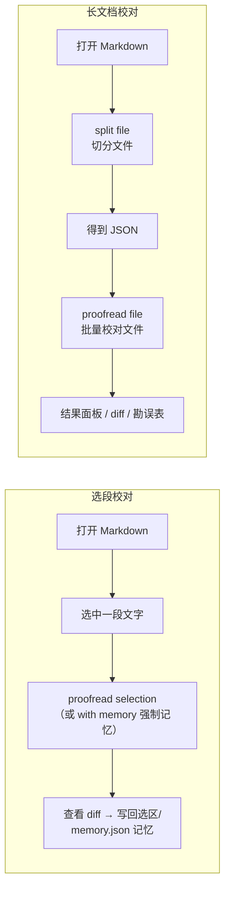
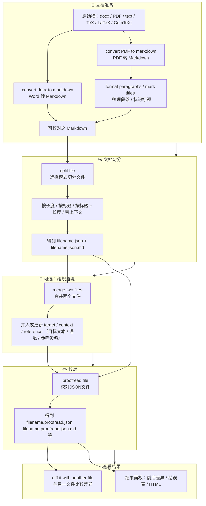
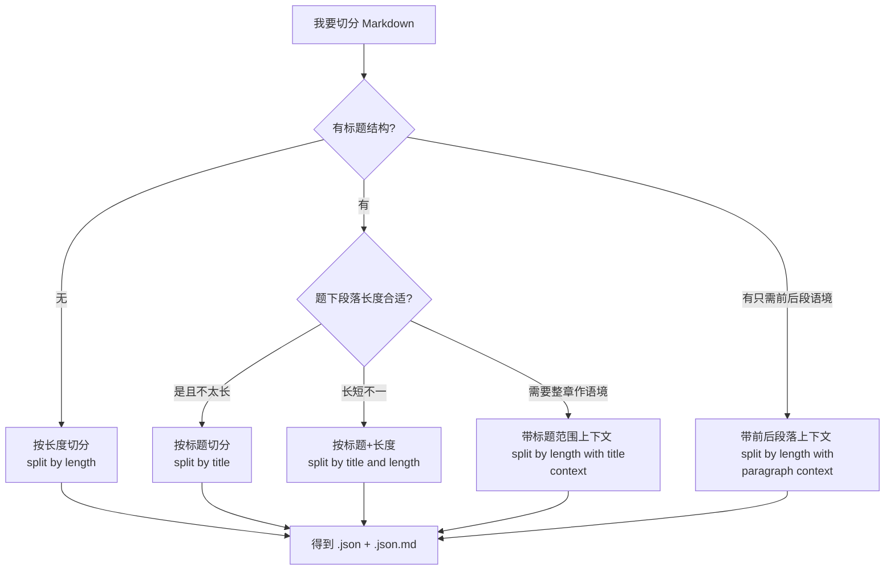
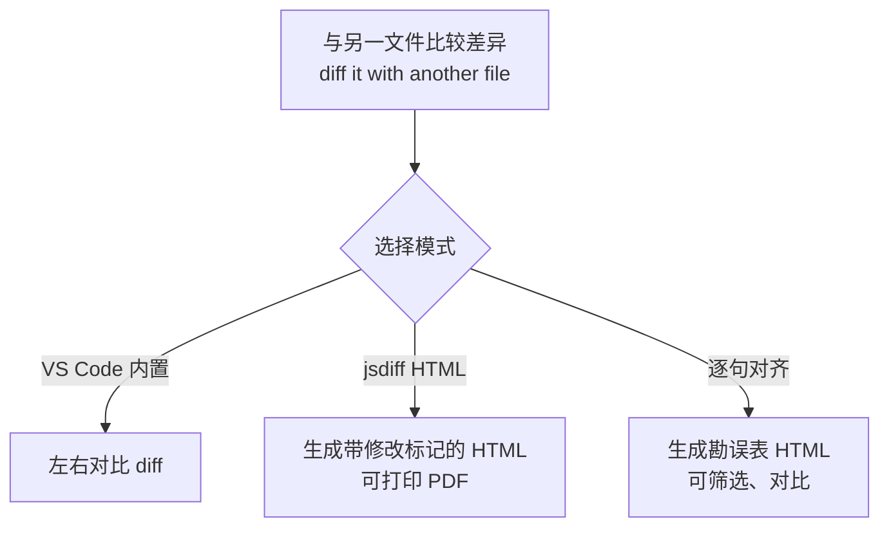

# AI Proofreader 扩展命令速查与业务流程图

*v1.11.4*

> **文档定位**：本文档是**快速入口**——帮你从业务场景找到对应流程和命令。详细说明、依赖安装、最佳实践见扩展主页面或 [README](https://github.com/Fusyong/ai-proofread-vscode-extension/blob/main/README.md)。

---

## 30 秒概览

**四个入口**：（1）左侧活动栏 **overview**：打开**校对面板** / **检索面板**，并开关侧栏 TreeView；（2）**校对面板**集中文档准备、切分、校对、比较与字词/重文等命令；（3）**检索面板**集中参考资料多源检索、命中勾选导出与引文相关命令；（4）命令面板（Ctrl+Shift+P）输入「AI Proofreader」可查全部命令；部分命令也有**右键菜单**。

| 能力 | 说明 |
|------|------|
| **文档准备** | **校对面板**：docx/PDF（可选）、整理段落、标记标题、切分等 |
| **校对路径** | ① 选段：`proofread selection`（或 **`proofread selection with memory`**）；② 长文档：切分 →「校对 JSON 文件」；需要 reference 时可在检索面板准备/导出后指定 |
| **资料检索** | **检索面板**：配置来源 → 多轮准备 → 侧栏「资料检索」勾选/导出 md →「参考选中校对当前选段」；单源检索与外跳工具见面板底部快捷栏 |
| **结果查看** | **校对面板**「比较前后差异」「生成勘误表」；或 diff 命令 |
| **辅助功能** | 校对面板：字词检查、重文扫描、序号等；检索面板：引文核对；**overview** 可开关侧栏视图（模型路由、提示词、字词检查、资料检索、引文核查、重文检查、标题树、段内序号、校对条目） |
| **用户扩展能力** | 自定义提示词、自定义替换表、jieba 词典、标题/序号规则，见 [第六节](#六用户扩展能力) |

---

## 目录

- [一、各业务场景快速入口](#一各业务场景快速入口)
- [二、业务词汇 → 功能对照](#二业务词汇--功能对照)
- [三、典型业务流程（Mermaid 图）](#三典型业务流程mermaid-图)
- [四、命令速查表](#四命令速查表)
- [五、重要设置项](#五重要设置项)
- [六、用户扩展能力](#六用户扩展能力)
- [七、说明与建议](#七说明与建议)

---

## 一、各业务场景快速入口

从你的稿件类型或任务出发，找到简明操作指引。流程图见 [第三节](#三典型业务流程mermaid-图)。

### 1.1 书稿（Word/PDF 来稿，整本书校对）

先打开 **校对面板**（命令 open proofreading panel），面板内有**按钮**完成大部分操作。

| 步骤 | 操作（优先用 UI） |
|------|-------------------|
| 1. 打开校对面板 | 通过左侧活动栏图标的指引打开 **校对面板**；或在命令面板输入「open proofreading panel」→ 打开 **校对面板** |
| 2. 文件转换（可选） | 面板顶部点 **「docx → Markdown」** 或 **「PDF → Markdown」**（docx 需 Pandoc；PDF 在 Windows 已内置 pdftotext） |
| 3. 整理（可选） | 面板内点 **「整理段落」**、**「根据目录标记标题」** |
| 4. 选主文件 | 面板内点 **「选择主文件」** 或 **「从工作区选择」** |
| 5. 切分 | 面板内点 **「切分文档」**，选择切分模式（见 [3.3](#33-切分模式选择决策简图)） |
| 6. 校对 | 面板内点 **「校对JSON文件」** |
| 7. 查看 | 面板内点 **「比较前后差异」** 或 **「生成勘误表」** |

### 1.2 单篇文章 / 选段

| 任务 | 操作（优先用 UI） |
|------|-------------------|
| 校对这一小段 | 选中文字 → **右键** → **proofread selection**（或 **with memory**）；或 **校对面板** 底部对应链接 |
| 先查资料再校对 | overview → **检索面板** → 开始准备 → 勾选命中 → **参考选中校对当前选段** |
| 要带固定参考全文 | 选段校对时选「使用参考文件」；或 JSON **Merge Two Files** 并入 Markdown |

### 1.3 练习册（题 + 答案需一起校对）

| 步骤 | 操作（优先用 UI） |
|------|-------------------|
| 1. 切分 | **校对面板** 选主稿 → 点 **「切分文档」**，得到 JSON |
| 2. 合并语境 | **校对面板** 切分完成后，点 **「合并 JSON」**，选答案文件，拼接到 target 或 context |
| 3. 校对 | **校对面板** 点 **「校对JSON文件」** |

### 1.4 学术稿（需核对引文 / 查资料）

| 步骤 | 操作（优先用 UI） |
|------|-------------------|
| 1. 建索引 | 设置 `citation.referencesPath` → **检索面板** 底部 **「建立引文索引」** |
| 2. 核对选中 | 选中引文 → **检索面板** **「核对选中引文」** → 侧栏 **资料检索** |
| 3. 核对全文 | **检索面板** **「核对全文引文」** → 侧栏 **引文核查** |
| 4. 多源检索 | **检索面板** 勾选来源 → **开始准备**；或底部单源 / 外跳命令 |

### 1.5 专项检查（错别字、异形词、序号、重文）

| 任务 | 操作（优先用 UI） |
|------|-------------------|
| 字词检查 | **校对面板** **「字词检查」** → overview 打开相关侧栏视图 |
| 标题与序号 | overview **标题树 / 段内序号**；或命令 **check numbering hierarchy** |
| 重文检查 | **校对面板** **「重复句扫描」** → 侧栏 **重文检查** |

### 1.6 其他常用操作

| 我想… | 建议操作（优先用 UI） |
|-------|------------------------|
| 看改了哪里 | **校对面板** **「比较前后差异」** / **「生成勘误表」**；或右键 diff |
| 换一种 AI 用法 | overview **提示词**；或 **校对面板** **「管理提示词」** |
| 分词或词频统计 | **校对面板** **「分词与统计」** |
| 转 Word 交稿 | **校对面板** **「Markdown → docx」** |
| 清除检索缓存 | **检索面板** **「清除检索缓存」** |

---

## 二、业务词汇 → 功能对照

用 Ctrl+F 搜索业务词，快速定位功能。

| 业务词 | 对应功能 |
|--------|----------|
| 校稿、审稿、改错 | proofread selection / proofread file |
| 出勘误表、审校记录 | diff it with another file → 逐句对齐 |
| 核对引文、查出处 | verify selected citation（资料检索）/ verify citations（引文核查） |
| 查词典、查参考资料 | 检索面板；Look Up Selection / Search References* |
| 转 Word、转 Markdown | convert docx/markdown |
| 查错别字、异形词 | check words |
| 检查序号、标题层级 | check numbering hierarchy |
| 重文、重复句 | scan duplicate sentences |
| 分词、词频、字频 | segment file / segment selection |
| 合并语境、加参考资料 | merge two files；检索面板导出/合并到 JSON |

---

## 三、典型业务流程（Mermaid 图）

### 3.1 两种主要校对路径

```mermaid
flowchart LR
    subgraph 方式一["选段校对"]
        S1["打开 Markdown"]
        S2["选中一段文字"]
        S3["proofread selection<br/>（或 with memory 强制记忆）"]
        S4["查看 diff → 写回选区/<br/>memory.json 记忆"]
        S1 --> S2 --> S3 --> S4
    end

    subgraph 方式二["长文档校对"]
        L1["打开 Markdown"]
        L2["split file <br> 切分文件"]
        L3["得到 JSON"]
        L4["proofread file <br> 批量校对文件"]
        L5["结果面板 / diff / 勘误表"]
        L1 --> L2 --> L3 --> L4 --> L5
    end
```

### 3.2 长文档校对整体流程

```mermaid
flowchart TB
    subgraph 准备["📄 文档准备"]
        A["原始稿：docx / PDF / text / TeX / LaTeX / ComTeXt"]
        B["convert docx to markdown <br> Word 转 Markdown"]
        C["convert PDF to markdown <br> PDF 转 Markdown"]
        D["format paragraphs / mark titles <br> 整理段落 / 标记标题"]
        E["可校对之 Markdown"]
        A --> B
        A --> C
        B --> E
        C --> D
        D --> E
    end

    subgraph 切分["✂️ 文档切分"]
        E --> F["split file <br> 选择模式切分文件"]
        F --> G["按长度 / 按标题 / 按标题 + 长度 / 带上下文"]
        G --> H["得到 filename.json + filename.json.md"]
    end

    subgraph 语境["🔗 可选：组织语境"]
        H --> I["merge two files <br> 合并两个文件"]
        I --> J["并入或更新 target / context / reference （目标文本 / 语境 / 参考资料）"]
    end

    subgraph 校对["✏️ 校对"]
        J --> K["proofread file <br> 校对JSON文件"]
        H --> K
        K --> L["得到 filename.proofread.json filename.proofread.json.md 等"]
    end

    subgraph 查看["👀 查看结果"]
        L --> M["diff it with another file <br> 与另一文件比较差异"]
        L --> N["结果面板：前后差异 / 勘误表 / HTML"]
    end

    准备 --> 切分
    切分 --> 语境
    语境 --> 校对
    校对 --> 查看
```

### 3.3 切分模式选择（决策简图）

```mermaid
flowchart TD
    Start["我要切分 Markdown"] --> Q1{"有标题结构?"}
    Q1 -->|无| ByLen["按长度切分 <br> split by length"]
    Q1 -->|有| Q2{"题下段落长度合适?"}
    Q2 -->|是且不太长| ByTitle["按标题切分 <br> split by title"]
    Q2 -->|长短不一| ByTitleLen["按标题+长度 <br> split by title and length"]
    Q2 -->|需要整章作语境| WithTitleCtx["带标题范围上下文 <br> split by length with title context"]
    Q1 -->|有只需前后段语境| WithParaCtx["带前后段落上下文 <br> split by length with paragraph context"]

    ByLen --> Out["得到 .json + .json.md"]
    ByTitle --> Out
    ByTitleLen --> Out
    WithTitleCtx --> Out
    WithParaCtx --> Out
```

### 3.4 比较与生成勘误表/审校记录

```mermaid
flowchart TD
    Diff["与另一文件比较差异 <br> diff it with another file"] --> Mode{"选择模式"}
    Mode -->|VS Code 内置| A["左右对比 diff"]
    Mode -->|jsdiff HTML| B["生成带修改标记的 HTML <br> 可打印 PDF"]
    Mode -->|逐句对齐| C["生成勘误表 HTML <br> 可筛选、对比"]
```

### 3.5 引文核对流程

```mermaid
flowchart LR
    A["设置文献库路径"] --> B["检索面板：建立引文索引"]
    B --> C["核对选中引文 / 核对全文引文"]
    C --> D["选中：侧栏「资料检索」<br/>全文：侧栏「引文核查」"]
    D --> E["diff / PDF 反查"]
```

---

## 四、命令速查表

**优先用 UI**：

- **校对面板**（overview「校对面板」或 `open proofreading panel`）：文档转换/整理、切分校对、字词与序号、重文、diff、提示词与设置。
- **检索面板**（overview「检索面板」或 `Open Reference Search Panel`）：多源准备、单源检索、外跳搜索、引文核对、清除检索缓存；命中可勾选导出 md/JSON，或「参考选中校对当前选段」。
- 两面板底部快捷命令**不重复**；命令面板（Ctrl+Shift+P）输入「AI Proofreader」可查全部。⭐ 表示核心/常用。

| 命令 | 简短说明 |
|------|----------|
| **文档转换**（校对面板） | |
| AI Proofreader: convert docx to markdown | 将 Word(docx) 转为 Markdown，需安装 Pandoc |
| AI Proofreader: convert PDF to markdown | 将活文字 PDF 转为 Markdown（Windows 内置 pdftotext；其他系统需自行安装） |
| AI Proofreader: convert markdown to docx | 将 Markdown 转为 Word(docx) |
| **文档整理**（校对面板） | |
| AI Proofreader: format paragraphs | 整理段落：段末加空行 / 删除段内分行 |
| AI Proofreader: mark titles from table of contents | 根据目录表（Markdown 列表）在文档中标记标题 |
| AI Proofreader: check numbering hierarchy | 检查带序号的标题，也可用于标记这些标题 |
| AI Proofreader: convert quotes to Chinese | 半角引号转全角（可设为校对后自动执行） |
| **文档切分与语境合并** | |
| AI Proofreader: split file ⭐ | 切分文件（统一入口，会提示选择切分模式） |
| AI Proofreader: split by length | 按长度切分，输入目标字符数 |
| AI Proofreader: split by title | 按标题切分，输入标题级别（如 1,2） |
| AI Proofreader: split by title and length | 按标题+长度：题下过长则再切、过短则合并 |
| AI Proofreader: split by length with title context | 按长度切分，并为每段配上所在标题范围的上下文（注意 token 费用） |
| AI Proofreader: split by length with paragraph context | 按长度切分，并为每段配上前后段落作为上下文（注意 token 费用） |
| AI Proofreader: merge two files | 合并两个 JSON：把语境/参考资料并入校对用 JSON |
| **合并与校对**（校对面板） | |
| AI Proofreader: open proofreading panel ⭐ | 打开 **校对面板** |
| AI Proofreader: proofread file ⭐ | 批量校对当前打开的 JSON 文件 |
| AI Proofreader: proofread selection ⭐ | 校对当前选中的文本（选段校对） |
| AI Proofreader: proofread selection with memory ⭐ | 选段校对并强制启用项目编辑记忆注入与写回 |
| AI Proofreader: split into sentences | 将整篇或选区按简易中文分句，并用所选分隔符连接 |
| **比较与结果呈现** | |
| AI Proofreader: diff it with another file ⭐ | 比较两个文件差异（内置 diff / 生成 HTML 差异 / 生成勘误表） |
| **提示词** | |
| AI Proofreader: manage prompts | 管理提示词：增、删、改；在侧栏 prompts 视图中选择当前提示词 |
| **分词与统计**（校对面板） | |
| AI Proofreader: segment file | 分词 / 词频统计 / 字频统计（整文件） |
| AI Proofreader: segment selection | 分词 / 词频统计 / 字频统计（选中部分） |
| **专项检查**（校对面板 + overview 开关） | |
| AI Proofreader: check words | 字词检查：词典检查、通用规范汉字表、自定义替换表 |
| AI Proofreader: manage custom tables | 管理自定义替换表 |
| AI Proofreader: check numbering hierarchy | 检查标题序号层级与段内序号 |
| AI Proofreader: scan duplicate sentences in document / selection | 重文检查（全文 / 选区） |
| **参考资料检索**（检索面板；命令面板搜 `AI Proofreader Search`） | |
| Open Reference Search Panel ⭐ | 打开 **检索面板**（配置、时间线、勾选命中、导出、底部快捷命令） |
| Prepare References for Selection / JSON File | 选段或多源批量准备 reference |
| Knowledge Verify Selection | 选段知识核查（准备 ± 校对 / 用已有资料） |
| Look Up Selection in Local Dictionary | 精确整词查本地 MDX（无 LLM） |
| Search with Local Dictionary / Grep·BM25·Vector / Wikipedia / Web | 单源 LLM 规划检索 |
| LLM-Enhanced Grep Search | 自然语言多源检索（`search_intent`） |
| Search Selection in References (Find in Files) | Find in Files（即时工具，无 LLM） |
| Verify Selected Citation / Verify Citations / Build Citation Reference Index | 引文核对（结果：资料检索树 / 引文核查树） |
| Clear Project Retrieval Cache | 清除 `.proofread/retrieval-cache.json` |
| **便捷工具**（检索面板底部；`AI Proofreader Tools`） | |
| Search Selection in PDF / Shidianguji / Ancientbooks | 外跳；不进入 reference corpus |
| Search Citation in PDF | 引文树右键：文献 PDF 反查 |

---

## 五、重要设置项

**进入方式**：VS Code 左下角 **齿轮 ⚙️** → **扩展** → AI Proofreader → **设置**；或 overview / 校对面板 **「设置」**；或 Preferences: Open Settings (UI)，搜索 `ai-proofread`。

### 5.1 必配：大模型与 API

| 设置项 | 简短说明 |
|--------|----------|
| **proofread.platform** | 大模型服务平台：deepseek / aliyun / google / ollama |
| **apiKeys.deepseek** | Deepseek 开放平台 API 密钥（平台选 deepseek 时必填） |
| **apiKeys.aliyun** | 阿里云百炼 API 密钥（平台选 aliyun 时必填） |
| **apiKeys.google** | Google Gemini API 密钥（平台选 google 时必填） |
| **apiKeys.ollama** | Ollama 本地服务地址，如 `http://localhost:11434` |
| **proofread.models.*** | 各平台模型名，如 deepseek-chat、qwen-max、gemini-2.5-pro 等 |

### 5.2 常用：校对行为与切分

| 设置项 | 简短说明 |
|--------|----------|
| **proofread.temperature** | 模型温度 [0~2)，默认 1.0 |
| **proofread.timeout** | 单次 API 请求超时（**秒**），默认 90 |
| **proofread.rpm** | 每分钟最大请求数；百炼 qwen-max 稳定版常为 600 |
| **proofread.maxConcurrent** | 最大并发请求数，默认 10 |
| **proofread.disableThinking** | 是否禁用模型“思考”（Gemini 2.5 等），校对建议开启 |
| **convertQuotes** | 是否在校对后自动将半角引号转为中文全角 |
| **defaultSplitLength** | 按长度切分时的默认目标字符数，默认 600 |
| **defaultTitleLevels** | 按标题切分时的默认标题级别，如 [2] |
| **proofread.defaultContextLevel** | 选段校对时默认的标题级语境范围，0 表示不用 |

### 5.3 进阶：勘误表、引文、字词、序号、检索缓存

| 类别 | 主要设置项 |
|------|------------|
| **勘误表/对齐** | alignment.similarityThreshold、windowSize、ngramSize、ngramGranularity |
| **jieba 分词** | jieba.customDictPath、jieba.cutMode |
| **引文核对** | citation.referencesPath、matchesPerCitation、minCitationLength、lenDeltaRatio |
| **字词检查** | wordCheck.replacePrefix/Suffix、wordErrorCollector.* |
| **标题与序号** | numbering.ignoreMarkdownPrefix、customLevels、customInlinePatterns |
| **资料检索** | referencePrep.*（来源、强度、维基、retrievalCache.enabled / ttlHours / maxEntries） |

完整配置说明见 [README - 配置](https://github.com/Fusyong/ai-proofread-vscode-extension/blob/main/README.md)。

---

## 六、用户扩展能力

用户可通过以下方式扩展或定制扩展行为，无需改代码。

| 扩展项 | 入口 / 配置 | 简要说明 |
|--------|-------------|----------|
| **自定义提示词** | overview **提示词**；**校对面板**「管理提示词」；侧栏 prompts | 可做翻译、专项核查、注释等；需说明 target、reference、context |
| **自定义替换表** | **校对面板**「管理自定义替换表」；侧栏 custom checks | 字词检查用，支持正则；可积累 `.word-errors.csv` |
| **jieba 自定义词典** | 设置 `jieba.customDictPath` | 分词、词频、勘误表对齐等用；格式：每行「词语 词频 词性」 |
| **标题层级规则** | 设置 `numbering.customLevels` | 标题树检查用；自定义序号格式 |
| **段内序号规则** | 设置 `numbering.customInlinePatterns` | 段内序号检查用；自定义 pattern |

详细说明见扩展主页面或 [README](https://github.com/Fusyong/ai-proofread-vscode-extension/blob/main/README.md)。

---

## 七、说明与建议

- **Mermaid 图**：可在支持 Mermaid 的 Markdown 预览（如 VS Code 插件）、GitHub/GitLab、Notion 等中直接渲染为流程图。
- **命令查找**：命令面板输入「AI Proofreader」或「proofread」「split」「Search」等关键词即可缩小范围。
- **详细说明**：每个命令的详细用法、依赖（Pandoc、pdftotext、SumatraPDF 等）和注意事项见扩展主页面或 [README](https://github.com/Fusyong/ai-proofread-vscode-extension/blob/main/README.md)；设置说明可在设置界面看到。
- **面板分工**：资料检索、引文核对、外跳搜索只在**检索面板**；格式整理、校对、字词/序号/重文、diff 只在**校对面板**。