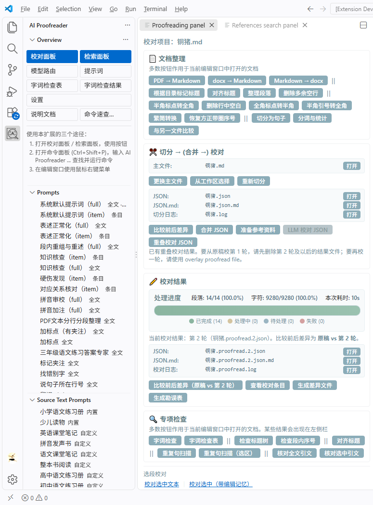
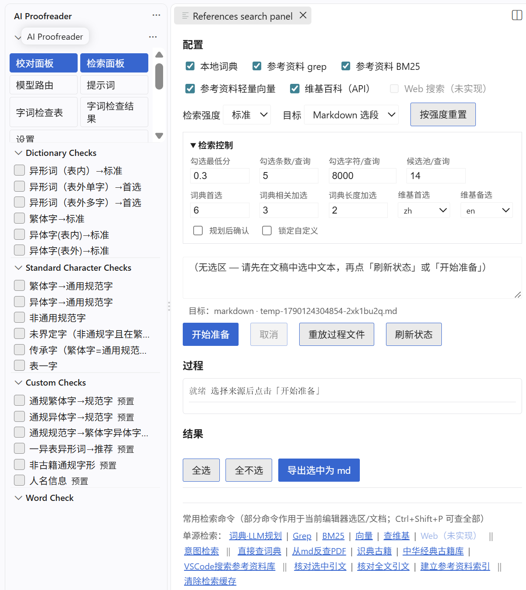
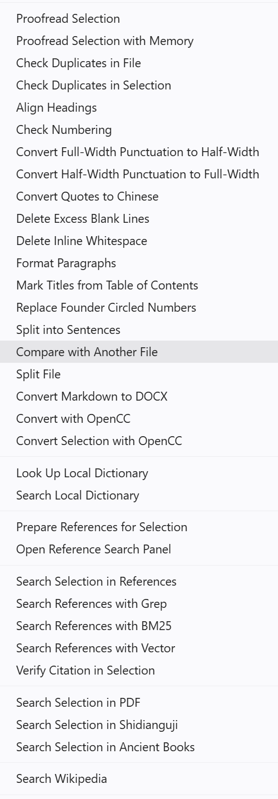
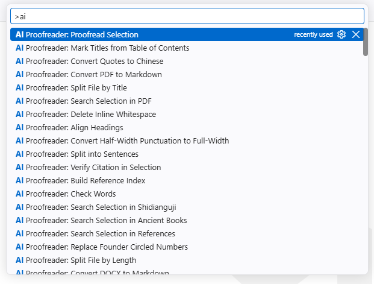
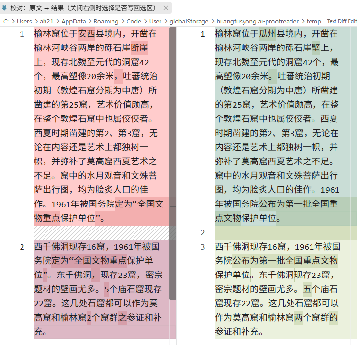
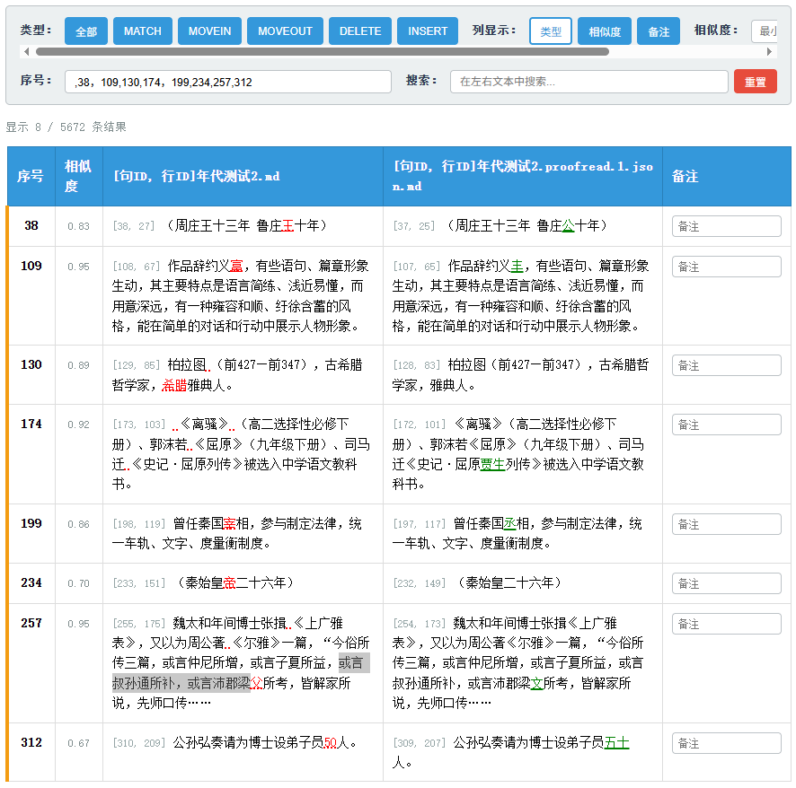
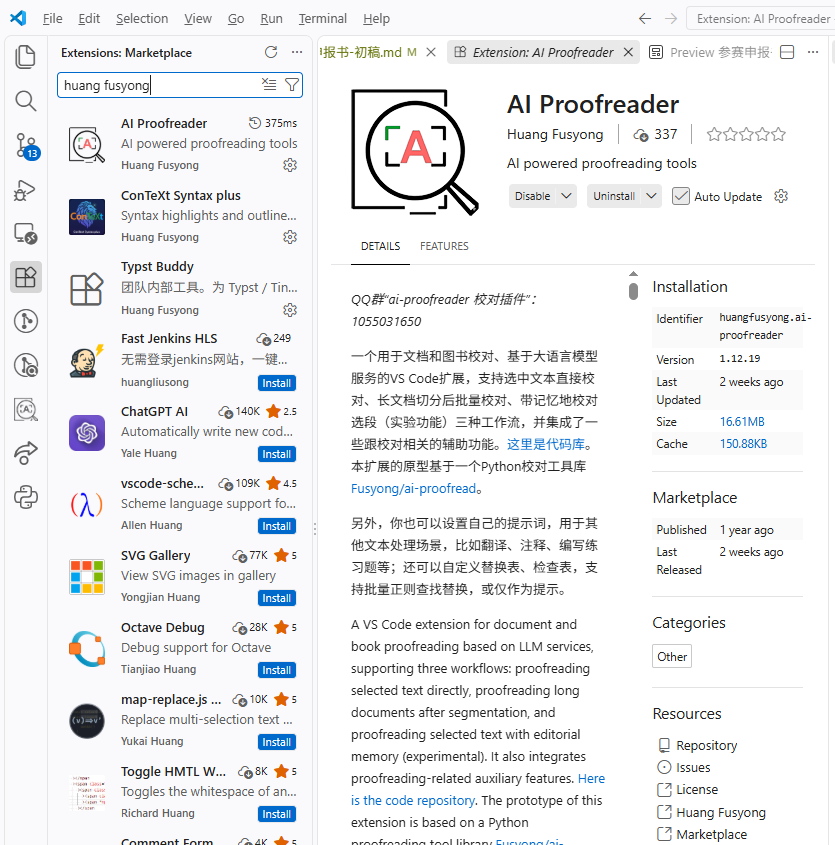

# 人工智能应用创新大赛申报书 AI Proofreader：面向图书编辑的可深度配置审校工作台

语文出版社　黄富雄  
2026年9月

<!-- @import "my-style.less" -->

**参赛类别：**

* （二）出版转型创新应用
    * 1. 出版流程智能化：编审校排

## 一、审校工作的痛点

审校工作头绪多，琐碎繁杂，很容易有疏漏，出错误。

审校一份书稿，图书编校要在一定的时间里完成这些事：按顺序通读书稿，或再加专项审读，找出潜在的问题；在全书语境中核实问题，如专名在全书中是否一致，练习题与答案是否一致；对照各种外部参考资料，如配套资料（如练习册配套教材）、工具书、在线文本库、相关专著书与论文等，核实问题；已核实的问题，把修改方案落到纸稿或电子稿上，并确保修改在各校次排版文件中得到正确体现；整理审改记录，留存审改档案。

书稿动辄十万字以上，逐字看当然是必须的，但时间稍紧，或精神疲怠，就容易出疏漏。发现了问题，还要在全书语境里核实，对照外部参考资料核实，更要用心多头判断：前后说法不一样、同一个人名写法不同、练习题和答案对不上、引文和原文有出入……教参、练习册、注释类图书尤其如此：题目和答案、正文和注释、古诗和权威解释，要在合在一起看齐；配套教材、词典、在线文本库和相关专著论文，常常要轮番打开。除了从前到后的审改，通常还要进行专项核对，比如核对目录、页眉页脚、栏目名称，或对注释、拼音、人物信息等进行专项强化审校。这些都不是“再仔细一点”就一定能搞定的，稍有懈怠就有可能放过。

修改方案落到纸稿或电子稿之后，仍须在各校次认真核红，核对排版文件是否已按改样改对，尤其是最终印刷版。这一步也很容易漏，尤其是稿件质量不高，改动很多时，纸稿上改过了，排印版里没有改或改错了，是常有的；更严重的是，因使用文件错误，上一校改过了，下一校可能又回去了。最后是根据全部审校工作整理出审改记录，并留存审改档案。整理审改记录相当费工，而留存纸质过程稿也有占用空间、不易复查、很难再再利用等问题。

因此，计算机辅助审校一直是编校人员的理想。现在，记性极好、永不懈怠的大语言模型爆发，让我们看到了希望。

## 二、市面常见傻瓜式审校应用的问题

近两年，市面上除了传统审校软件黑马校对，又出现了多款AI审校应用，比如方正智能审校、果麦AI校对王、蜜度校对通等。

传统审校软件基于字词和表达式级别的正误对查找替换，完全没有上下文语义理解能力，召回率、正确率很低，常常两三百处标红只有一处正确改动，编校人员的审核负担很重，收益很小。市面上流行AI审校应用，得益于LLM似乎无限制的生成能力，面确实能发现并改正很多书稿问题，能大大减轻编辑的审校压力。

但这些AI审校应用往往是“傻瓜式”的，一方面很方便，可以“一键操作”。但是，“一键操作”也带来了很多问题：

1. 改错和润色边界模糊，常常改动极多，导致极大的审核负担。
2. PDF文件解析策略有限，断行、分页常常破坏语境，复杂版面无法还原语流，稍有字距辄引入空格，方正排版软件常用的半角标点、字符替代则也引入批量错误。这些问题导致很多无效修改。
3. 侧栏标签说明对应版面着色锚点式的审核界面、审核方式，效率极低，负担相当重。编辑审核时必须一一打开标签，并找到对应的原文，对照原文阅读、理解标签改动方案，最后通过想象带入原文语境，判断是否正确。就界面容量而言，一屏只能放置二三个标签；从实际情况看，版面上往往着色锚点互相叠压，无法区分和操作。这样长的操作和决策链条和界面限制，导致审核的思维复杂度很高，心智负担重，审核效率低。
4. 傻瓜式应用缺乏灵活性，不能适应多样化的审校场景。有些书稿是名家力作，只能改错；有些书稿文字质量差，需要在改错基础上稍稍润色。有些儿童读物每个页面即为独立的语境，可以作为一个审校单元。学术专著、古诗文读本常常有页脚注，以页为审校单元可以处理正文与注释是否一致的问题；但同时还要以章节为单元进行审校，以便处理上下不一致的问题。版面复杂的“课堂笔记”、儿童书、双语对照读物等，需要把文本整理为正确的上下文，尽可能保留元素之间的对应关系，这样LLM才能更好地理解。练习册常常附答案，需要把答案与习题合并到一处审校。某些书需要参考权威资料，或查字典。另外，每一本书都有自己的特点，需要审校时有所侧重，比如儿童读物需要关注价值观是否正确、是否有行为误导等问题，双语对照、注音读物需要关注文本之间的对应关系；通读之外还常要专项核对目录、序号、引文、拼音、人物信息等。这些要求，都是市面上的傻瓜式审校应用所不能很好解决的。缺的不是再多一个“一键按钮”，而是能把审校拆成清楚环节，让编辑在需要时把自己的专业判断和手头资料送进去，并能把通读与专项深度分开做的工作方式。

## 三、AI Proofreader 简介

基于上述对审校工作痛点和常见傻瓜式审校应用问题的经验和理解，结合日常审校工作，笔者开发了AI Proofreader。AI Proofreader 是 VS Code 的一个扩展；而二者都是开源软件，代码库都托管在 GitHub 平台。

AI Proofreader 面向图书编辑，可根据稿件的具体需要、结合自己的审校经验进行深度配置；当然，大多数稿件也可按默认流程和参数直接用。

### （一）功能与界面

安装 VS Code 与本扩展后，在阿里云百炼或 DeepSeek 开放平台申请接口密钥填入即可；有从安装到出勘误表的分步说明可供对照。

扩展装在 VS Code 里，有三种使用方式：

其一，普通用户和初学者可从左侧活动栏打开侧栏的 AI Proofreader 概览。从概览可进入校对面板，完成大部分审校工作。从概览界面还能开关侧栏列表，如资料检索、引文核查、重文、标题树、提示词等。如图一。

**图一**

从概览界面还能进入资料检索面板，为文稿检索本地或在线的参考资料。如图二。

**图二**

其二，在编辑器界面，文档右键菜单也能调用跟当前文档类型相应的命令。

**图三**

其三，等熟练之后，就可以通过命令面板（Ctrl+Shift+P）输入“AI 校对”或“AI Proofreader”检索和使用全部命令。如图三。用户常用命令会排在最上面，不必每次都检索，多数命令的参数也能保持，因此这种方式更加快捷，特别适合重复操作。

**图四**

本扩展以三种校对工作流为主干，并配上文档整理、参考资料检索、专项检查等辅助能力。

#### 1. 三种校对工作流

**（1）选段即时校对**。适合短文、精读或边读边改。在 Markdown 文档中，选中一段，使用命令`proofread selection`，或使用相应的校对面板按钮、文档右键菜单，即可进行校对。校对完成后会自动打开差异对照编辑器（diff）。如图五。

**图五**

**（2）长文档切分后批量校对**。适合一次处理整本书。校对面板上大致四步（见图一）：

1. **文档整理**（可选）：Word / 活字 PDF 转 Markdown；整理段落，按目录标标题等。
2. **切分与合并**：选择主文件 → 按长度或标题等条件切分（得到 JSON）→ 需要时合并习题与答案、检索并合并参考资料等。
3. **LLM 校对 JSON**：批量校对切分片段（结果如 `文档.proofread.1.json`）；第 1 轮后还可用「重叠校对」，用上一轮全文再校一到多轮。
4. **校对结果**：在diff编辑器中比较前后差异（如上图）；还可以生成差异文件、勘误表/审改记录（如图六）。

**（3）带记忆的选段校对**（实验功能）。适合同一部稿里反复统一体例。选中段落用「带编辑记忆」校对，核准结果后会自动收集已确认的改法、通则，并写入编辑记忆文件，校对后续选段自动带上编辑记忆，减少每段重复说明。

三种工作流共用提示词与差异审核机制。自定义提示词时，同一套机制也可做翻译、加注、出练习题等各种你能想到的文本处理工作，不限于审校。实际上，本扩展是一组通用批量文字处理工作流，编辑可以展开想象，结合自己的专业知识、经验和需要，用它做各种文本处理工作（参考图一左侧栏的提示词）。

**图六**

#### 2. 界面上还看得见什么

见图一、图二。归类如下：

| 入口                      | 作用                                                                                                               |
| ------------------------- | ------------------------------------------------------------------------------------------------------------------ |
| **校对面板 · 文档整理**   | 转换格式、理段落标点、标/齐标题、分句分词、与另一文件比较——为切分和校对做准备                                      |
| **校对面板 · 切分与合并** | 切分、合并语境；进入「准备参考资料」或「LLM / 重叠校对」                                                           |
| **校对面板 · 校对结果**   | 进度、全文差异、差异文件、勘误表                                                                                   |
| **校对面板 · 专项检查**   | 字词与自制正误表、标题树与段内序号、对齐标题、重文、引文核对                                                       |
| **校对面板 · 底部**       | 选段校对 / 带记忆选段校对                                                                                          |
| **检索面板**              | 查词典、工作区文献、可选维基等；勾选后导出或并入参考；**只检索，不校对**。备好材料后回校对面板，可选用「知识核查」 |
| **管理提示词**            | 预置（硬伤、对应关系、拼音、知识核查等）、自定义，以及说明整书重点的「文本特性」提示词                             |

专项检查及其结果侧栏如图二。提示词管理侧栏见图一。

### （二）开发、使用与测评

笔者是图书编辑，2022 年起关注大语言模型在文本处理上的表现；2023 年底模型已能实际改稿后，按本人编校中的真实痛点动手做工具，起初做了 Python 原型库（[Fusyong/ai-proofread](https://github.com/Fusyong/ai-proofread)），验证了主要审校流程；随后做成 VS Code 扩展，以便嵌进日常改稿环境，并直接用上差异对照、多文件并排、版本管理等成熟能力，其代码库见 [Fusyong/ai-proofread-vscode-extension](https://github.com/Fusyong/ai-proofread-vscode-extension)。

本扩展功能，通常是笔者在处理具体书稿时，为解决具体问题而逐渐开发出来的，如 PDF 与 Word 转换、题答拼合、检索词典与文献、预置与自定义提示词、文本特性注入、专项检查、勘误表与错词积累等，并在自用与同事试用中反复修改。

本扩展小步更新，高频迭代。2025年4月5日发布于 VS Code 应用市场，总共更新了大小版本110个，平均约5天更新一个版本。目前仍在积极开发中。当前版本 v1.12.19，应用市场安装量337。扩展主页如图七。

**图七**

程序实现主要借助 Cursor 编程智能体，原型库部分代码为手工编写。审校类提示词为笔者结合经验撰写，资料检索和记忆库处理等提示词为人机共创。

扩展测试与实际使用中，主要调用阿里云百炼和DeepSeek开放平台上的LLM API。扩展同时支持 Google Gemini 的API和 Ollama 本地模型接口。

**使用情况**：

- 笔者已用本扩展处理百余种书稿，含协助同事处理的稿件；
- 本社有十余位编辑安装使用；
- 在语文社质检流程中，总编室安排专人试用本扩展对未经AI审校的稿件进行预检；
- 审校速度很快，十余万字的书稿，切分后提交审校，通常能在半分钟以内完成；
- 调用阿里云百炼、DeepSeek开放平台最新高性能API，普通校对模式，每十万字约需一至三元；
- 在高性能基座模型集中在少量头部AI公司的当下，个人与同事凭经验判断，本扩展在调用前沿大模型的情况下，审校效果不输于市面上常见的商业审校应用，且审核负担小得多，审核效率完胜。

**测评：**

以上判断仅基于少数人的经验。当前也没有公开的审校测评数据和平台。为了较为客观地评价本扩展的能力，笔者收集了网上公开的“韬奋杯”全国图书/出版社青年编校大赛、全国报刊编校技能大赛的篇章类试题，筛除没有参考答案的部分、聚焦于版权信息等纯行业知识的部分，以及字体字号版式等无法通过纯文本呈现的部分，然后使用本扩展审改，最后逐一核对参考答案并进行统计。

【待补】

## 四、AI Proofreader 怎样帮助编辑利用自己的专业知识和经验做好审校工作

AI Proofreader不做“一键出结果、侧栏点标签”的傻瓜式流程，而是把审校拆成几个清楚的环节，配上校对面板和一批辅助工具。一般书稿按预置流程和默认参数即可跑通：转换或打开 Markdown → 切分 → 校对 → 看差异。遇到特殊版面或特殊要求时，再按需要整理文本、调整切分、换提示词或补参考资料；通读之外若还要做专项核对，则用校对面板里的专项检查，或换用专项提示词再跑一轮——最大限度地利用编辑的专业知识、手头资料，并充分发挥大模型与规则工具各自的能力。深度配置是加分项，不是入门门槛。

### （一）文本整理与语境组织：稿件是什么样子，由编辑定

傻瓜式应用往往在解析和送审时替编辑做完决定：PDF 文字流怎么提取、按什么单位切、题目与答案分不分开、参考资料用不用……本扩展把选择权交还给编辑，但并不要求编辑从零手工拼出一份“完美语料”。日常路径很短：转换文档、必要时点几下整理，再按长度或标题切分即可开校。

**先整理成可审的文本。** 来稿若是 Word，或排版端导出的活字 PDF，用扩展内命令转成 Markdown 即可；Windows 下 PDF 转文本已随扩展附带，不必另装。死文字 PDF（文字已转曲或转成图像）仍须先做识别，这一步扩展不代劳。转出后若分段不清、断行分页碍眼，可用整理段落、按目录标记标题、对齐标题等命令清杂质；不必追求排版级完美——大模型对略有瑕疵的文本仍有较好的兼容与理解力，整理到“读得顺、切得开”往往就够。复杂版面的“课堂笔记”、儿童书、双语对照等，才需要多花一点工夫理清元素对应；傻瓜式“一键解析 PDF”省掉的，恰恰是这一步，也最容易引入误报误改。

**再按目的组织语境。** 一般语言文字校对，按长度切分（经验上六七百字一段）即可。要查前后一致，再改用按章切分，或给短段配上章节上下文。儿童读物可按页或按段；带页注的学术稿、古诗文读本，可先按页看正文与注释，再按章看全书。练习册把习题与答案拼进同一段，必要时并入配套课文。需要查证时，把词典、权威注释或文献拼进参考资料；手头没有现成摘录时，可用下一节的检索面板去查、勾选后再并入。模型每次看到目标文本，以及可选的上下文、参考资料。这些不是每本书都要全做：编辑对自己常做的那几种稿，摸清一两次之后，便形成固定习惯，后面同类稿会越来越省事。

整理文本确有琐碎之处，但大模型并不要求完美无瑕的语境；本扩展在转换、整理、切分、合并上提供的辅助工具，多数已在长期使用中磨顺。因此，一般书稿先走默认流程即可；遇到特殊版面或特殊要求时，再整理文本、调整切分、拼上手头的教材、词典或文献——把编辑的专业知识和已有材料用起来，用较小的整理成本，尽量发挥大模型的审校能力。深度配置是加分项，不是入门门槛。

### （二）参考资料检索：帮编辑查工具书、查参考资料

这是语境组织里很常见的一类特例：不是把已有文件直接拼进去，而是先替编辑把该查的工具书和参考资料找出来，再由编辑决定用不用、用哪几条。对应扩展里的**检索面板**（校对面板切分区块也可点「准备参考资料」进入）。检索只负责找材料和导出、合并，**不做校对**；校对仍回到校对面板，需要时再选用「知识核查」等提示词。

可勾选的来源包括：本地 MDX 词典、工作区里的参考资料目录（关键词检索、相关度排序等）、可选的维基百科等在线来源。既可按当前切分好的书稿批量准备，也可对选中段落做意图检索或直接查词典；命中结果出现在侧栏「资料检索」中，编辑逐条勾选，再合并进校对用的参考栏，或导出为 Markdown 后选段校对。引文专项核验也可在此建立本地文献索引，再核对选中引文或全文引文。

与傻瓜式应用里“厂商自带知识库、编辑看不到依据”不同：查什么、信哪一条、并入哪一段，都在编辑手里。材料不足时，模型按提示词不应臆造；编辑仍可按传统方式翻书补查。普通语言文字校对不必每次都走检索；传统文化、学术注释、专名释义等“不查工具书心里不踏实”的稿，这一步往往最省翻页时间。

### （三）预置提示词 + 自定义提示词 + 文本特性提示词：怎么审校，重点关注什么，由编辑定

审校时“怎么做”和“这部稿要特别盯什么”，都由编辑用提示词规定，而不是交给一键润色。本扩展里相关的有三类，多数时候点选即可，不必先学提示词工程。

**多种预置提示词，满足通用场景。** 名家力作用「硬伤发现」，少动可改可不改处；文字较差的稿可再加一轮「表述正常化」。两轮分开做，比一键大改更好审。另有常规语言文字校对、对应关系核对、知识核查、拼音审校等，在校对面板里点选。通读之后若要对注释对应、拼音、专名等做强化，换一条专项提示词再跑一轮即可，与第一节的「专项审读」相衔接。已经用检索面板备好参考资料时，可选用「知识核查」，要求模型依据已给材料判断，而不是凭空改。

**自定义提示词：按经验规定做法，也可超出审校范围。** 若某类书反复碰到同一类问题，把编辑自己的经验写成提示词（如儿童读物的价值观、注音读物的对应关系），写好后可一直沿用。同一套机制还可做翻译、加句读和注释、设计练习题、格式整理、意识形态风险提示等。笔者已在 GitHub 库[Fusyong/LLM-prompts-from-a-book-editor](https://github.com/Fusyong/LLM-prompts-from-a-book-editor)上分享十数种提示词。选中一段即可校对；体例要统一时，也可带上已确认的通则，免去每段重复说明。

**文本特性提示词：重点关注什么。** 系统默认与若干预置提示词在校对时可再注入「源文本特性」说明：这部书（或这一批稿）有什么独特之处、审校时要特别留心什么——例如体裁、读者对象、注音体例、不宜改动的部分等。目的是提醒模型：当前片段只是更大源文本的一部分，请按整书特性把握分寸。可在「管理提示词」时一并维护内置与自定义的文本特性条目；校对过程中按需选用，不选则不注入。自定义主提示词不会自动注入特性说明，以免打乱作者自己写好的逻辑。

三类可以叠用：预置或自定义决定“怎么审”，文本特性补充“这部稿重点盯什么”，都由编辑定。

### （四）改前改后全文对照审核，效率远超侧栏标签说明与版面锚点关联

模型返回的是改后全文。审核打开 VS Code 的差异对照即可：左侧改前删除点文本着深红，右侧改后插入点着深绿；也可以上下对照。用法接近编辑熟悉的校后通读——顺着正文看变色处，判断留下还是改回，不必在侧栏里逐个打开标签、对着着色锚点想象改完后的句子，也没有锚点叠压分不清的麻烦。确认后誊到纸稿；除非对电子稿有十分把握，不把电子稿直接灌入排版软件。

### （五）核红快捷可靠，版本全程可追溯，审改档案可复用

排印样回来，除了对着纸质红样核红，还可以从PDF转文本与上一版电子文本对照，核实上次修改是否进了排版文件，还可以看出是否有多余改动。

根据修改前后的电子文本，还能一键生成审改记录，还可以手动筛除不重要的改动；也可导出常用错词正误对，积少成多，积累成自己的常用检查库。原稿、修订稿和差异文件都留在文件夹里，占用少、可检索，可作为审校语料使用，也比堆纸质过程稿省事。

稍加学习，还可以通过VS Code和Git管理稿件版本，可顺手留下“初稿、作者修改、一校、二校、三校、通读、核红”这样的标签，减少文件数量和版本混乱，做到全流程修改可追溯。

### （六）专项检查：有针对性的强化审校

上面说过，除从前到后的审改外，通常还要专项核对目录、页眉页脚、栏目名称，或对注释、拼音、人物信息等做强化审校。傻瓜式一键审校很难按编辑指定的这一项做深；本扩展把这类工作放在校对面板的「专项检查」里，与大模型通读分工：规则能定的用规则扫，语义与知识仍交给模型或专项提示词。

用到时在面板点选即可，结果多在左侧栏定位，不必一次学全：

- **字词检查**：词典、规范汉字与异形词，以及编辑自制的正误表、人物与专名表等，适合人物信息、用字规范的专项强化。有心的编辑平时可以通过本扩展收集词语级别的正误对，或用正则表达式编写，形成自己的正误表，以此积淀经验，用于以后的审校工作。笔者及网友已经在GitHub 库[Fusyong/regexp-replace-lists-for-TextPro](https://github.com/Fusyong/regexp-replace-lists-for-TextPro)分量几十种检查替换表。
- **标题树与段内序号**：查层级与连续性，对应目录、章节序号一类问题。
- **对齐标题**：目录与正文、题本与答案并排时，检查标题是否一一对应；对不齐就停在差异处。
- **重文检查**：扫重复句，减轻通读时对“似曾相识”的遗漏。
- **引文核对**：与本地资料库做相似度匹配，辅助引文的专项核验（索引与核对也可从检索面板进入）。

简言之：预置流程保证普通稿开箱能用；需要时再动整理、切分、资料检索、提示词（含文本特性）和专项检查，让编辑规定怎么审、重点盯什么，通读与专项深度可以分开做，而不是停在厂商替你定好的一键菜单里。

## 五、典型使用场景

第二节所说的多样场景，本扩展都能照顾到，但日常仍是“能简则简”。一般书稿按转换 → 切分 → 校对 → 看差异即可。只有版面特殊、题答要合并、必须对照教材与词典，或审校侧重与默认不同时，才加整理、换提示词、开检索面板检索资料。通读之后若还要做目录、序号、引文、拼音、人物生卒年、年号、字形词形等专项核对，则再进行专项检查，或使用专项提示词强化校对——恰恰在这些地方，编辑的专业知识和手头资料能得到充分利用。

典型使用场景举例：

**一般书稿。** 转成文本 → 按较短篇幅切分 → 默认提示词校对 → 差异审核 → 誊到纸稿；排印样回来核对纸质红样，或再转文本核红。如有必要，比较初稿和终稿差异，可生成审改记录/勘误表。

**名家力作与文字较差的书稿。** 在预置提示词里换一项即可：前者用硬伤发现，保守地改；后者可加表述正常化，稍作润色，仍嫌不足时可自制提示词。不必改流程，只换提示词。

**练习册、教参有参照资料的书稿。** 通过标注标题和标题对齐工具整理对应资料，用合并命令把题与答（必要时连同配套课文）拼到同一段，再正常校对，或选“对应关系核对”专项校对。对齐和拼合需要稍加学习。目录与正文、题与答的标题是否齐，可用对齐标题专项检查。标注标题和标题对齐过程，能发现隐秘的不一致问题，对齐后校对，整体效果要好得多。

**带页下注的学术稿、古诗文读本。** 这些书的一页就是一个相对完整的语境。导出文本后用Ctrl+Shift+L全选分页符，多光标同时编辑为伪标题，然后就可以标题（即按页）切分、校对。按页设计的书都可以这样处理。还可以按章节再跑一次。学术书如果常常要核对资料，还可以用检索面板查本地词典、本地文献与维基百科网站，勾选并入资料后再走校对流程。引文（包括练习册、教参中引用教材原文）专项核验可用“引文核对”功能。古籍原文可通过内置工具直接跳转到中华经典古籍库和识典古籍网站核对。

**儿童读物、双语或注音读物、版面复杂的课堂笔记类。** PDF 转文本时使用raw（原始文字流）模式，可以得到正常语流。使用layout（版面布局）模式，可以把注音读物的音字交替文字流分开为音、字各占一行。全文注音读物可用拼音审校提示词专门审一次拼音。有价值观等专项需要时再换相应提示词，或在文本提醒提示词中提出要求。

**通读之后的专项强化审校。** 可专项审校字形词形、人物生卒年、年号等。或通过标题树检查章节序号是否错乱。重文检查可以扫描重复表述。还有拼音、注释对应等专项提示词，也可以用于专项审校。专项审校是培养与利用编辑专业知识与技能的好形式。

本扩展主要用于文本处理，此外，笔者还开发有PDF版面差异核对工具[Fusyong/PDFDiffer](https://github.com/Fusyong/PDFDiffer)，用于检查PDF版面图文的微小变化，包括文字改动；PDF 批量正则搜索聚合查看工具[Fusyong/PDFSearchViewer](https://github.com/Fusyong/PDFSearchViewer)，用来批量检查PDF元素的一致性，如同级标题、栏目文字表述和版式是否一致。

## 六、限制与风险提示

本审校扩展在编校流程中的定位始终是“辅助”，而不是不“替代”，编校人员始终是决策者和责任者。通常模式下，扩展改动时不会给出说明，即使个别情形下给出改动说明，编校人员也必须查证、判断，再誊抄到纸稿上，并在改后核红。——手动“誊抄到纸稿”可以看做一个物理隔离机制。如果直接发排本扩展审校过的电子稿，则后续完整编校流程不可或缺。

本扩展调用的是通用大语言模型，会遗漏问题，会过度修改，甚至会把对的的改错，绝对不应该无脑采纳、批量采纳。

PDF转文字后，文字整理不是必需的，但整理得当能提高审校效果，减轻审校负担。尤其是题目与答案对齐、语境拼合等工作，能大大提高审校可靠性。

有些复杂版面的PDF，比如单栏与双栏交替，且原始文本流无法正确导出，这时本扩展工具无法处理，可以使用笔者改进过的开源的OCR工具[Fusyong/RapidDoc](https://github.com/Fusyong/RapidDoc)等处理。

单次审校往往有缺陷，建议至少处理两轮：一轮按默认长度（六百多字）审校，保证有足够的注意力审改字词句；一轮按章节标题等完整语境审校，处理一致性问题。模型每次处理有预算限制，问题较多的稿件可以重叠审校多次（人工一次审核最终改动）；重复语境功能也能提高审校密度和精度。

出于成本考虑，本扩展暂不支持图片审校。

本扩展没有后台，不会向作者发送任何数据。用户的LLM平台秘钥保存在用户本机，用户应妥善保存并定期更换。本扩展会将书稿文本发送到所选择的LLM平台处理，用户应了解所选平台的协议与规则，并注意涉密问题。

## 七、本扩展开发中如何使用人工智能，以及权利说明

本扩展核心流程与编校提示词为笔者原创，编辑记忆、资料检索规划等环节的提示由Cursor辅助完成。字词检查所用规范数据，从互联网公开资料中获得，并经笔者整理。程序实现由Cursor辅助完成。测试时主要调用阿里云百炼、DeepSeek开放平台当时的最优文本模型。

扩展性能测评使用WorkBuddy收集、整理互联网上公开的“韬奋杯”全国图书/出版社青年编校大赛、全国报刊编校技能大赛的篇章类试题，并由WorkBuddy根据原题答案和评分标准完成逐个评分点的核对与评分；试题范围由笔者确定，评分点核对与评分明细表格经过笔者核查。

扩展依赖如下的运行环境、工具和库（权利归原作者，本扩展仅在其许可下调用或分发）：

| 组件或服务 | 用途 | 说明 |
| ---------- | ---- | ---- |
| Visual Studio Code | 编辑器、差异对照、版本管理、扩展运行环境 | 开源编辑器；本扩展遵循其机制 |
| Node.js | 扩展运行时 | 要求 ≥18.12.1（随 VS Code 扩展宿主） |
| 大模型接口 | 按提示词生成修订文本、资料检索规划等 | 阿里云百炼、DeepSeek、Google Gemini、Ollama 等，由使用者自备密钥并遵守各平台条款；书稿文本将发送至所选平台 |
| Pandoc | Word 与 Markdown 互转 | 须使用者另行安装 |
| Xpdf（pdftotext） | Windows 下活字 PDF 转文本 | GPL，随扩展分发（许可文本在扩展内） |
| jieba-wasm | 分词与词频 | 整理与统计用，集成于本扩展 |
| jsdiff（`diff`） | 行内差异展示、逐句对齐勘误表等 | 开源库，随扩展打包 |
| mdict-js | 本地 MDX 词典查询 | 资料检索用，集成于本扩展 |
| sql.js | 本地参考资料索引（检索 / 引文核对） | 集成于本扩展 |
| @vscode/ripgrep | 工作区文献关键词检索 | 资料检索用，随扩展分发 |
| opencc-js | 繁简 / 地区用字转换 | 文档整理用，集成于本扩展 |

字词检查所用《通用规范汉字表》、异形词表等规范对照数据，取自互联网公开资料，经笔者整理后随扩展提供。开发阶段使用的 Cursor、WorkBuddy 等为智能体，不随扩展分发给最终用户。
